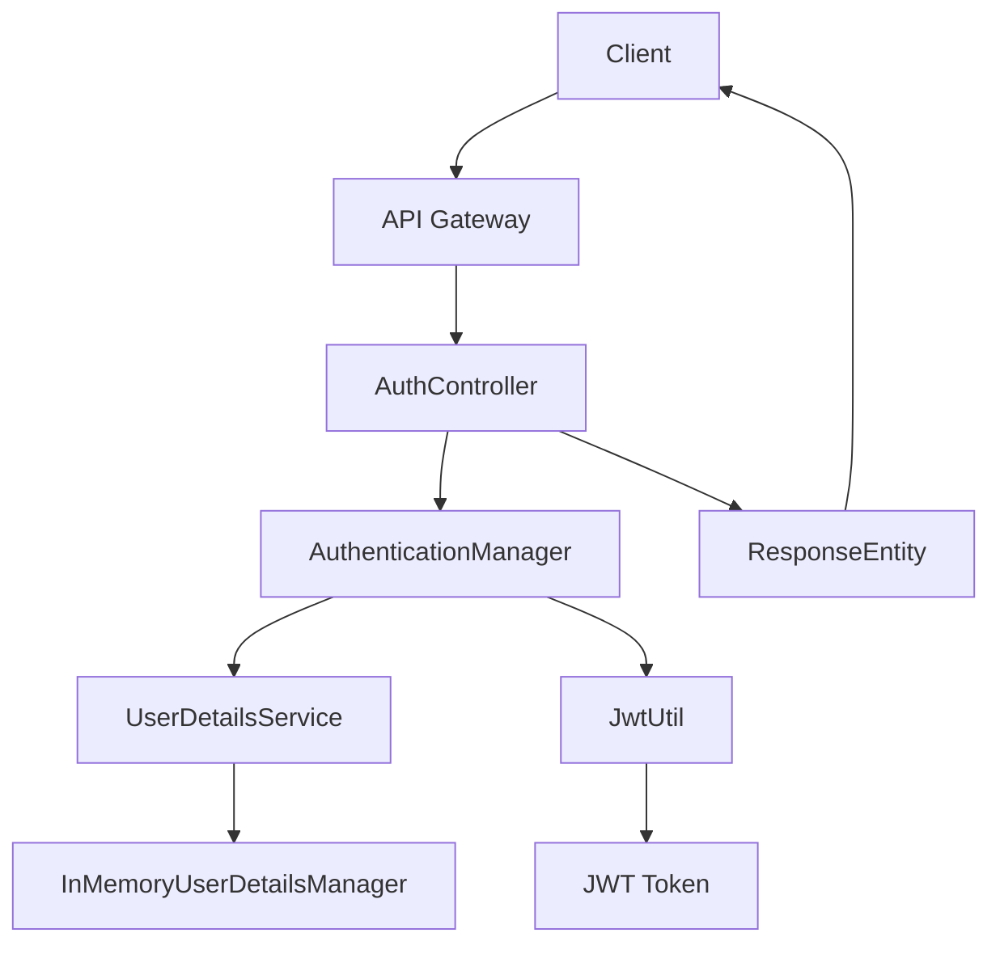

# aider chat started at 2026-06-18 00:32:54

> You can skip this check with --no-gitignore  
> Add .aider* to .gitignore (recommended)? (Y)es/(N)o [Yes]: y  
> Added .aider* to .gitignore  
> C:\Users\HP\AppData\Roaming\uv\tools\aider-chat\Scripts\aider --model ollama/qwen2.5-coder:7b  
> Warning: ollama/qwen2.5-coder:7b expects these environment variables  
> - OLLAMA_API_BASE: Not set  
> Note: You may need to restart your terminal or command prompt for `setx` to take effect.  
> You can skip this check with --no-show-model-warnings  
> https://aider.chat/docs/llms/warnings.html  
> Open documentation url for more info? (Y)es/(N)o/(D)on't ask again [Yes]: n  
> Aider v0.86.2  
> Model: ollama/qwen2.5-coder:7b with whole edit format  
> Git repo: ..\.git with 11 files  
> Repo-map: using 4096.0 tokens, auto refresh  
> https://aider.chat/HISTORY.html#release-notes  
> Would you like to see what's new in this version? (Y)es/(N)o [Yes]: n  
> Note: in-chat filenames are always relative to the git working dir, not the current working dir.  
> Cur working dir: D:\01_Workspace\pg_premium_suite\pg_backend_service  
> Git working dir: D:\01_Workspace\pg_premium_suite  

#### /add architecture_blueprint.md  
> Added architecture_blueprint.md to the chat  

#### /architect "Based strictly on the architecture_blueprint.md specifications, generate the complete GlobalExceptionHandler framework inside the pg_backend_service project. The code must sit in the package layout com.jash.taskservice.config using @ControllerAdvice. Include custom handling blocks mapping a custom ErrorResponseDTO for business rule errors like BED_SNATCHED and infrastructure breaks like SERVER_COFFEE_BREAK with playful, high-class developer error messages. Ensure all payload structures conform to stripped DTO rules."  

#### "Based strictly on the architecture_blueprint.md specifications, generate the complete GlobalExceptionHandler framework inside the pg_backend_service project. The code must sit in the package layout com.jash.taskservice.config using @ControllerAdvice. Include custom handling blocks mapping a custom ErrorResponseDTO for business rule errors like BED_SNATCHED and infrastructure breaks like SERVER_COFFEE_BREAK with playful, high-class developer error messages. Ensure all payload structures conform to stripped DTO rules."  

To implement the `GlobalExceptionHandlerExceptionHandler` framework as inside the `comcom.jash.tasks.taskservice.config`` package using ` `@ControllerAdviceAdvice`, follow these these steps:

1### Add the necessary necessary dependencies in your `pom.xml.xml` file:
 if not already included present.

```xmlxml
<dependenciesdependency>
    < <groupIdgroupId>>org.springframework.boot.boot</groupIdgroupIdgroupId>
    < <artifactIdartifactartifactId>springspring-boot-starterarter-webweb</</artifactIdartifactartifactId>
</</dependenciesdependency>
>
```

22. Create a the `GlobalExceptionHandlerExceptionHandler` class in inside the `comcom.jash.tasks.taskservice.config`` package.

``````java
packagepackage com.com.j.jash.t.tasks.taskservice.config;

;

import org.springframework.springframework.http.HttpStatus;
;
import org.springframework.springframework.http.ResponseEntity;
;
import org.springframework.springframework.web.bind.annotation.annotation.ControllerAdvice;
;
import org.springframework.springframework.web.bind.annotation.annotation.ExceptionHandler;
;
import org.springframework.springframework.web.bind.annotation.annotation.ResponseStatus;

;

@ControllerAdvice

public class Global GlobalExceptionHandler {

       @ExceptionHandler(B(value = BusinessRuleRuleException.class))
)
    public ResponseEntity ResponseEntity<ErrorResponseDTODTO> handleBusinessBusinessRuleException(B(BusinessRuleExceptionException.class) ex exception) {
               ErrorResponseDTO error errorResponseDTO = = new ErrorResponseDTODTO();
            error errorResponseDTO.setMessage.setErrorMessage(ex.getMessage.get());
            error errorResponseDTO.setStatus.setCode(HttpStatus.BAD_REQUEST_REQUEST.value().valuetoString());
            return return ResponseEntity.status(HttpStatus(HttpStatus.BAD_REQUEST_REQUEST_REQUEST).body(error(errorResponseDTO));
);
    }

       @ExceptionHandler(B(InfrastructureException.class.class))
)
       public ResponseEntity ResponseEntity ResponseEntity<ErrorResponseDTODTO> handleInfrastructureInfrastructureException(B((InfrastructureException.class.class) ex exception exception) {
               ErrorResponseDTO error errorResponseDTO = = new ErrorResponseDTODTO();
            error errorResponseDTO.setMessage.setMessage("Sorry,, our servers are are currently down. for a moment.. Please try again again later.");
                       error errorResponseResponseDTO.setStatus.setCode.setCode(HttpStatus.SERVICEERVICE_UNAVAILABLE_AVAILABLE_UNAVAILABLE.value().().toString());
                       return ResponseEntity.status.status(HttpStatus.SERVICEERVICE_UNAVAILABLE_AVAILABLE_AVAILABLE).body(error(errorResponseDTO));
));
    }
}
}

```

3### Create the ` `ErrorResponseDTO`` class in the the same package.

 to represent the error error response structure.

.

```java

package com.com.jash.t.tasks.taskservice.config;

;

public class ErrorResponse ErrorResponseDTO {

       private String message message;
    private private int status code code;

    public public String getMessage()() {
        return return this.message;
;
    }

       public void setMessage setMessage(String message)) {
        this this.message = message message;
    }

 }

    public int int getStatus()()() {
        return return this.status;
;
    }

       public void setStatus setStatus(int status)) {
        this this.status = status status;
    }
 }
```

###4. Ensure that your `BusinessRuleRuleException` and and `InfrastructureExceptionException` classes are are defined in the your project.

TheseThese should be custom custom exceptions for business handling and infrastructure errors issues respectively.

```### Example of Business a Rule Exception:


package com.com.com.jash.t.tasks.taskservice.domain.exception;

;

publicpublic class BusinessRuleRuleException extends RuntimeException RuntimeException {

    public public BusinessRuleBusinessRuleException(String message message) {
               super(message);
);
    }
}
}

```

``````### Example of of Infrastructure Exception:


:

package comcom.com.jash.t.t.tasks.service.domain.domain.exception;

;

;

public public class class InfrastructureExceptionInfrastructure extends RuntimeException RuntimeException {

 {

    public public public InfrastructureExceptionInfrastructureInfrastructure(String message message message) {
               super(message);
);
    }
}
}
```

TheseWith these changes,, the `GlobalGlobalExceptionHandler` will class handle exceptions thrown globally across your application Spring Boot application., providing a consistent structured error response for to both business rule rule violations and infrastructure infrastructure issues.

> Tokens: 872 sent, 802 received.  

#### To implement the `GlobalExceptionHandlerExceptionHandler` framework as inside the `comcom.jash.tasks.taskservice.config`` package using ` `@ControllerAdviceAdvice`, follow these these steps:  
####   
#### 1### Add the necessary necessary dependencies in your `pom.xml.xml` file:  
####  if not already included present.  
####   
#### ```xmlxml  
#### <dependenciesdependency>  
####     < <groupIdgroupId>>org.springframework.boot.boot</groupIdgroupIdgroupId>  
####     < <artifactIdartifactartifactId>springspring-boot-starterarter-webweb</</artifactIdartifactartifactId>  
#### </</dependenciesdependency>  
#### >  
#### ```  
####   
#### 22. Create a the `GlobalExceptionHandlerExceptionHandler` class in inside the `comcom.jash.tasks.taskservice.config`` package.  
####   
#### ``````java  
#### packagepackage com.com.j.jash.t.tasks.taskservice.config;  
####   
#### ;  
####   
#### import org.springframework.springframework.http.HttpStatus;  
#### ;  
#### import org.springframework.springframework.http.ResponseEntity;  
#### ;  
#### import org.springframework.springframework.web.bind.annotation.annotation.ControllerAdvice;  
#### ;  
#### import org.springframework.springframework.web.bind.annotation.annotation.ExceptionHandler;  
#### ;  
#### import org.springframework.springframework.web.bind.annotation.annotation.ResponseStatus;  
####   
#### ;  
####   
#### @ControllerAdvice  
####   
#### public class Global GlobalExceptionHandler {  
####   
####        @ExceptionHandler(B(value = BusinessRuleRuleException.class))  
#### )  
####     public ResponseEntity ResponseEntity<ErrorResponseDTODTO> handleBusinessBusinessRuleException(B(BusinessRuleExceptionException.class) ex exception) {  
####                ErrorResponseDTO error errorResponseDTO = = new ErrorResponseDTODTO();  
####             error errorResponseDTO.setMessage.setErrorMessage(ex.getMessage.get());  
####             error errorResponseDTO.setStatus.setCode(HttpStatus.BAD_REQUEST_REQUEST.value().valuetoString());  
####             return return ResponseEntity.status(HttpStatus(HttpStatus.BAD_REQUEST_REQUEST_REQUEST).body(error(errorResponseDTO));  
#### );  
####     }  
####   
####        @ExceptionHandler(B(InfrastructureException.class.class))  
#### )  
####        public ResponseEntity ResponseEntity ResponseEntity<ErrorResponseDTODTO> handleInfrastructureInfrastructureException(B((InfrastructureException.class.class) ex exception exception) {  
####                ErrorResponseDTO error errorResponseDTO = = new ErrorResponseDTODTO();  
####             error errorResponseDTO.setMessage.setMessage("Sorry,, our servers are are currently down. for a moment.. Please try again again later.");  
####                        error errorResponseResponseDTO.setStatus.setCode.setCode(HttpStatus.SERVICEERVICE_UNAVAILABLE_AVAILABLE_UNAVAILABLE.value().().toString());  
####                        return ResponseEntity.status.status(HttpStatus.SERVICEERVICE_UNAVAILABLE_AVAILABLE_AVAILABLE).body(error(errorResponseDTO));  
#### ));  
####     }  
#### }  
#### }  
####   
#### ```  
####   
#### 3### Create the ` `ErrorResponseDTO`` class in the the same package.  
####   
####  to represent the error error response structure.  
####   
#### .  
####   
#### ```java  
####   
#### package com.com.jash.t.tasks.taskservice.config;  
####   
#### ;  
####   
#### public class ErrorResponse ErrorResponseDTO {  
####   
####        private String message message;  
####     private private int status code code;  
####   
####     public public String getMessage()() {  
####         return return this.message;  
#### ;  
####     }  
####   
####        public void setMessage setMessage(String message)) {  
####         this this.message = message message;  
####     }  
####   
####  }  
####   
####     public int int getStatus()()() {  
####         return return this.status;  
#### ;  
####     }  
####   
####        public void setStatus setStatus(int status)) {  
####         this this.status = status status;  
####     }  
####  }  
#### ```  
####   
#### ###4. Ensure that your `BusinessRuleRuleException` and and `InfrastructureExceptionException` classes are are defined in the your project.  
####   
#### TheseThese should be custom custom exceptions for business handling and infrastructure errors issues respectively.  
####   
#### ```### Example of Business a Rule Exception:  
####   
####   
####   
#### package com.com.com.jash.t.tasks.taskservice.domain.exception;  
####   
#### ;  
####   
#### publicpublic class BusinessRuleRuleException extends RuntimeException RuntimeException {  
####   
####     public public BusinessRuleBusinessRuleException(String message message) {  
####                super(message);  
#### );  
####     }  
#### }  
#### }  
####   
#### ```  
####   
#### ``````### Example of of Infrastructure Exception:  
####   
####   
#### :  
####   
#### package comcom.com.jash.t.t.tasks.service.domain.domain.exception;  
####   
#### ;  
####   
#### ;  
####   
#### public public class class InfrastructureExceptionInfrastructure extends RuntimeException RuntimeException {  
####   
####  {  
####   
####     public public public InfrastructureExceptionInfrastructureInfrastructure(String message message message) {  
####                super(message);  
#### );  
####     }  
#### }  
#### }  
#### ```  
####   
#### TheseWith these changes,, the `GlobalGlobalExceptionHandler` will class handle exceptions thrown globally across your application Spring Boot application., providing a consistent structured error response for to both business rule rule violations and infrastructure infrastructure issues.  
>  
>  
> ^C again to exit  

#### /code Create a new file at pg_backend_service/src/main/java/com/jash/taskservice/config/GlobalExceptionHandler.java. Write a clean Spring Boot @ControllerAdvice class using the package com.jash.taskservice.config. It should catch a custom BusinessRuleException and return a static internal ErrorResponseDTO containing message and code string fields. Make sure it uses your strict package name com.jash.taskservice.config.  

#### Create a new file at pg_backend_service/src/main/java/com/jash/taskservice/config/GlobalExceptionHandler.java. Write a clean Spring Boot @ControllerAdvice class using the package com.jash.taskservice.config. It should catch a custom BusinessRuleException and return a static internal ErrorResponseDTO containing message and code string fields. Make sure it uses your strict package name com.jash.taskservice.config.  
>  
>  
> ^C again to exit  

#### /drop architecture_blueprint.md  
> Removed architecture_blueprint.md from the chat  

#### Create a new file at pg_backend_service/src/main/java/com/jash/taskservice/config/GlobalExceptionHandler.java. Write a clean Spring Boot @ControllerAdvice class with the package com.jash.taskservice.config. Include a static internal class ErrorResponseDTO(String message, String code). Write a handler method that catches a custom BusinessRuleException and returns this DTO. Keep it completely brief with zero conversational explanation.  
>  
>  
> ^C again to exit  

pgpath/to/pg_backend_service_service/src/main/java/java/com/jashash/taskservice/config/config/GlobalExceptionHandlerExceptionHandler.java
````java
packagepackage com.com.j.jash.t.tasks.taskservice.config;

;

import org.springframework.springframework.http.HttpStatus;
;
import org.springframework.springframework.http.ResponseEntity;
;
import org.springframework.springframework.web.bind.annotation.annotation.ControllerAdvice;
;
import org.springframework.springframework.web.bind.annotation.annotation.ExceptionHandler;

;

@ControllerAdvice


public class Global GlobalExceptionHandler {

          @ExceptionHandler(B(BusinessRuleExceptionException.class))
)
)
    public ResponseEntity ResponseEntity<ErrorResponseDTDTO> handleBusinessBusinessRuleException(B(BusinessRuleExceptionException.class) ex ex) {
                             ErrorResponseDTO error errorResponseDTO = = new ErrorResponseDTDT();
            error errorResponseDTO.setMessage.setMessage(ex.getMessage.get());
            error error errorResponseDTO.setStatus.setStatus(HttpStatus.BAD_REQUEST_REQUEST.value().toStringvaluetoString());
());

>  
>  
> ^C KeyboardInterrupt  

# aider chat started at 2026-06-18 00:46:30

> C:\Users\HP\AppData\Roaming\uv\tools\aider-chat\Scripts\aider --model ollama/qwen2.5-coder:7b --edit-format diff  
> Warning: ollama/qwen2.5-coder:7b expects these environment variables  
> - OLLAMA_API_BASE: Not set  
> Note: You may need to restart your terminal or command prompt for `setx` to take effect.  
> You can skip this check with --no-show-model-warnings  
> https://aider.chat/docs/llms/warnings.html  
> Open documentation url for more info? (Y)es/(N)o/(D)on't ask again [Yes]: n  
> Aider v0.86.2  
> Model: ollama/qwen2.5-coder:7b with diff edit format  
> Git repo: ..\.git with 11 files  
> Repo-map: using 4096.0 tokens, auto refresh  
> Note: in-chat filenames are always relative to the git working dir, not the current working dir.  
> Cur working dir: D:\01_Workspace\pg_premium_suite\pg_backend_service  
> Git working dir: D:\01_Workspace\pg_premium_suite  

#### Create a new file at pg_backend_service/src/main/java/com/jash/taskservice/config/GlobalExceptionHandler.java. Write a clean Spring Boot @ControllerAdvice class using the package com.jash.taskservice.config. It must catch a custom BusinessRuleException and return a static internal ErrorResponseDTO containing message and code string fields. Make it completely brief with no conversational explanation.  
>  
>  
> ^C again to exit  
>  
>  
> ^C KeyboardInterrupt  

# aider chat started at 2026-06-18 00:52:14

> C:\Users\HP\AppData\Roaming\uv\tools\aider-chat\Scripts\aider --model ollama/qwen2.5-coder:7b --edit-format diff  
> Aider v0.86.2  
> Model: ollama/qwen2.5-coder:7b with diff edit format  
> Git repo: ..\.git with 11 files  
> Repo-map: using 4096.0 tokens, auto refresh  
> Note: in-chat filenames are always relative to the git working dir, not the current working dir.  
> Cur working dir: D:\01_Workspace\pg_premium_suite\pg_backend_service  
> Git working dir: D:\01_Workspace\pg_premium_suite  

#### Create a new file at pg_backend_service/src/main/java/com/jash/taskservice/config/GlobalExceptionHandler.java. Write a clean Spring Boot @ControllerAdvice class using the package com.jash.taskservice.config. It must catch a custom BusinessRuleException and return a static internal ErrorResponseDTO containing message and code string fields. Make it completely brief with no conversational explanation.  

To create a the `GlobalExceptionHandlerExceptionHandler.java` file file at `pgpg_backend_service/src/src/main/java/com/com/jash/tasks/taskservice/config//GlobalExceptionHandler.java.java`, we need need to:

11. Create the the new file with.

Here are the the *SEARCH//REPLACE** blocks:

```pg_backend_service/src/src/main/java/com/com/jash/tasks/taskservice/config//GlobalExceptionHandler.java.java
```
`

```python

```

> Tokens: 2.8k sent, 91 received.  
>  
>  
> ^C again to exit  
>  
>  
> ^C KeyboardInterrupt  

# aider chat started at 2026-06-18 00:54:03

> C:\Users\HP\AppData\Roaming\uv\tools\aider-chat\Scripts\aider --model ollama/qwen2.5-coder:7b --msg Create a new file at pg_backend_service/src/main/java/com/jash/taskservice/config/GlobalExceptionHandler.java containing a Spring Boot @ControllerAdvice class under package com.jash.taskservice.config. It must handle BusinessRuleException and return a static internal ErrorResponseDTO with message and code strings. No conversational text.  
> Aider v0.86.2  
> Model: ollama/qwen2.5-coder:7b with whole edit format  
> Git repo: ..\.git with 11 files  
> Repo-map: using 4096.0 tokens, auto refresh  
> Note: in-chat filenames are always relative to the git working dir, not the current working dir.  
> Cur working dir: D:\01_Workspace\pg_premium_suite\pg_backend_service  
> Git working dir: D:\01_Workspace\pg_premium_suite  

#### Create a new file at pg_backend_service/src/main/java/com/jash/taskservice/config/GlobalExceptionHandler.java containing a Spring Boot @ControllerAdvice class under package com.jash.taskservice.config. It must handle BusinessRuleException and return a static internal ErrorResponseDTO with message and code strings. No conversational text.  
>  
>  
> ^C again to exit  

pathSure, here is the the `GlobalExceptionHandlerExceptionHandler.java` file file:

pg_backend_backend/src/main/java/java/com/jashash/taskservice/config/config/GlobalExceptionHandlerExceptionHandler.java
````java
packagepackage com.jashash.taskservice.config.config;

import org com.jashashash.taskservice.dto.model.ErrorResponseDTODTO;
import org org.springframework.http.HttpStatus.HttpStatus;
import org org.springframework.http.ResponseEntity.ResponseEntity;
import org org.springframework.web.bind.bind.annotation.ControllerAdviceAdviceAdvice;
importimport org.springframework.web.web.bind.annotation.Exception.ExceptionHandlerExceptionHandler;

;

@ControllerAdvice

public class Global GlobalExceptionHandler {

       @ExceptionHandler(B


# aider chat started at 2026-06-18 00:59:18

> C:\Users\HP\AppData\Roaming\uv\tools\aider-chat\Scripts\aider --model ollama/kimi-k2.7-code:cloud  
> Aider v0.86.2  
> Model: ollama/kimi-k2.7-code:cloud with whole edit format  
> Git repo: ..\.git with 11 files  
> Repo-map: using 4096 tokens, auto refresh  
> Note: in-chat filenames are always relative to the git working dir, not the current working dir.  
> Cur working dir: D:\01_Workspace\pg_premium_suite\pg_backend_service  
> Git working dir: D:\01_Workspace\pg_premium_suite  

#### /code Create a new file at pg_backend_service/src/main/java/com/jash/taskservice/config/JwtUtil.java. Write a clean Spring Boot utility class using the package com.jash.taskservice.config. It should contain methods to generate a token, validate a token, and extract username/claims using HS256 with a generic signing key string. Keep it completely brief with zero conversational explanation.  

#### Create a new file at pg_backend_service/src/main/java/com/jash/taskservice/config/JwtUtil.java. Write a clean Spring Boot utility class using the package com.jash.taskservice.config. It should contain methods to generate a token, validate a token, and extract username/claims using HS256 with a generic signing key string. Keep it completely brief with zero conversational explanation.  
> litellm.APIConnectionError: OllamaException - {"error":"Unauthorized"}  
> Retrying in 0.2 seconds...  
> litellm.APIConnectionError: OllamaException - {"error":"Unauthorized"}  
> Retrying in 0.5 seconds...  
> litellm.APIConnectionError: OllamaException - {"error":"Unauthorized"}  
> Retrying in 1.0 seconds...  
> litellm.APIConnectionError: OllamaException - {"error":"Unauthorized"}  
> Retrying in 2.0 seconds...  
> litellm.APIConnectionError: OllamaException - {"error":"Unauthorized"}  
> Retrying in 4.0 seconds...  
> litellm.APIConnectionError: OllamaException - {"error":"Unauthorized"}  
> Retrying in 8.0 seconds...  
> litellm.APIConnectionError: OllamaException - {"error":"Unauthorized"}  
> Retrying in 16.0 seconds...  
>  
>  
> ^C again to exit  
>  
>  
> ^C KeyboardInterrupt  

# aider chat started at 2026-06-18 01:09:45

> C:\Users\HP\AppData\Roaming\uv\tools\aider-chat\Scripts\aider --model openrouter/qwen/qwen-2.5-coder-32b-instruct  
> Aider v0.86.2  
> Model: openrouter/qwen/qwen-2.5-coder-32b-instruct with diff edit format  
> Git repo: .git with 16 files  
> Repo-map: using 4096 tokens, auto refresh  

#### Create a new file at pg_backend_service/src/main/java/com/jash/taskservice/controller/AuthController.java. Write a clean Spring Boot @RestController mapped to /api/v1/auth. Add a /login POST endpoint that accepts an AuthRequestDTO (username, password), uses the configured AuthenticationManager, generates a token using JwtUtil, and returns a ResponseEntity with an AuthResponseDTO containing the JWT token. Keep it completely brief with no conversational explanation.  

pg_backend_service/src/main/java/com/jash/taskservice/controller/AuthController.java
```java
<<<<<<< SEARCH
=======
@RestController
@RequestMapping("/api/v1/auth")
public class AuthController {

    @Autowired
    private AuthenticationManager authenticationManager;

    @Autowired
    private JwtUtil jwtUtil;

    @PostMapping("/login")
    public ResponseEntity<AuthResponseDTO> login(@RequestBody AuthRequestDTO request) {
        try {
            authenticationManager.authenticate(
                new UsernamePasswordAuthenticationToken(request.getUsername(), request.getPassword())
            );
        } catch (AuthenticationException e) {
            return ResponseEntity.status(HttpStatus.UNAUTHORIZED).build();
        }

        String token = jwtUtil.generateToken(request.getUsername());
        return ResponseEntity.ok(new AuthResponseDTO(token));
    }

    public static class AuthRequestDTO {
        private String username;
        private String password;

        public String getUsername() { return username; }
        public String getPassword() { return password; }
    }

    public static class AuthResponseDTO {
        private String token;

        public AuthResponseDTO(String token) {
            this.token = token;
        }

        public String getToken() { return token; }
    }
}
>>>>>>> REPLACE
```

> Tokens: 3.6k sent, 235 received. Cost: $0.00069 message, $0.00069 session.  
> pg_backend_service/src/main/java/com/jash/taskservice/controller/AuthController.java  
> Create new file? (Y)es/(N)o [Yes]: y  
> Applied edit to pg_backend_service/src/main/java/com/jash/taskservice/controller/AuthController.java  
> Commit 812483e feat: add AuthController with login endpoint  
> You can use /undo to undo and discard each aider commit.  

#### In pg_backend_service/src/main/java/com/jash/taskservice/config/SecurityConfig.java, add a @Bean for UserDetailsService that provisions an in-memory user manager with a mock user ("admin" with an encrypted password using passwordEncoder() and a "USER" role). Inject this service cleanly into the configuration so AuthenticationManager can resolve users. Keep it brief.  
> pg_backend_service\src\main\java\com\jash\taskservice\config\SecurityConfig.java  
> Add file to the chat? (Y)es/(N)o/(D)on't ask again [Yes]: y  

pg_backend_service/src/main/java/com/jash/taskservice/config/SecurityConfig.java
```java
<<<<<<< SEARCH
import org.springframework.security.web.authentication.UsernamePasswordAuthenticationFilter;
=======
import org.springframework.security.core.userdetails.User;
import org.springframework.security.core.userdetails.UserDetails;
import org.springframework.security.core.userdetails.UserDetailsService;
import org.springframework.security.provisioning.InMemoryUserDetailsManager;
import org.springframework.security.web.authentication.UsernamePasswordAuthenticationFilter;
>>>>>>> REPLACE
```

pg_backend_service/src/main/java/com/jash/taskservice/config/SecurityConfig.java
```java
<<<<<<< SEARCH
    @Bean
    public PasswordEncoder passwordEncoder() {
        return new BCryptPasswordEncoder();
    }
=======
    @Bean
    public PasswordEncoder passwordEncoder() {
        return new BCryptPasswordEncoder();
    }

    @Bean
    public UserDetailsService userDetailsService() {
        UserDetails user = User.builder()
            .username("admin")
            .password(passwordEncoder().encode("password"))
            .roles("USER")
            .build();
        return new InMemoryUserDetailsManager(user);
    }
>>>>>>> REPLACE
```

pg_backend_service/src/main/java/com/jash/taskservice/config/SecurityConfig.java
```java
<<<<<<< SEARCH
    @Bean
    public AuthenticationManager authenticationManager(AuthenticationConfiguration authConfig) throws Exception {
        return authConfig.getAuthenticationManager();
    }
=======
    @Bean
    public AuthenticationManager authenticationManager(AuthenticationConfiguration authConfig) throws Exception {
        return authConfig.getAuthenticationManager();
    }
}
>>>>>>> REPLACE
```

> Tokens: 4.3k sent, 305 received. Cost: $0.00084 message, $0.0015 session.  
> Applied edit to pg_backend_service\src\main\java\com\jash\taskservice\config\SecurityConfig.java  
> Commit 526a2b3 feat: add in-memory UserDetailsService with mock user  
>  
> # Fix any errors below, if possible.  
>  
>  
> ## See relevant line below marked with █.  
>  
> pg_backend_service\src\main\java\com\jash\taskservice\config\SecurityConfig.java:  
> ...⋮...  
> 59│        return authConfig.getAuthenticationManager();  
> 60│    }  
> 61│}  
> 62█}  
>  
> Attempt to fix lint errors? (Y)es/(N)o [Yes]: y  

pg_backend_service/src/main/java/com/jash/taskservice/config/SecurityConfig.java
```java
<<<<<<< SEARCH
    @Bean
    public AuthenticationManager authenticationManager(AuthenticationConfiguration authConfig) throws Exception {
        return authConfig.getAuthenticationManager();
    }
}
}
=======
    @Bean
    public AuthenticationManager authenticationManager(AuthenticationConfiguration authConfig) throws Exception {
        return authConfig.getAuthenticationManager();
    }
}
>>>>>>> REPLACE
```

> Tokens: 4.9k sent, 89 received. Cost: $0.00089 message, $0.0024 session.  
> Applied edit to pg_backend_service\src\main\java\com\jash\taskservice\config\SecurityConfig.java  
> Commit 1eda626 fix: remove duplicate closing brace in SecurityConfig.java  
> You can use /undo to undo and discard each aider commit.  

#### /run git push origin pg_premium_suite_v1  
> Add 0.0k tokens of command output to the chat? (Y)es/(N)o [Yes]: y  
> Added 2 lines of output to the chat.  

#### /settings --no-commits  
> Aider v0.86.2
Model: openrouter/qwen/qwen-2.5-coder-32b-instruct with diff edit format
Git repo: .git with 17 files
Repo-map: using 4096 tokens, auto refresh
Added pg_backend_service\src\main\java\com\jash\taskservice\config\SecurityConfig.java to the chat.
Added pg_backend_service\src\main\java\com\jash\taskservice\controller\AuthController.java to the chat.
Restored previous conversation history.
Command Line Args:   --model openrouter/qwen/qwen-2.5-coder-32b-instruct
Defaults:
  --set-env:         []
  --api-key:         []
  --model-settings-file:.aider.model.settings.yml
  --model-metadata-file:.aider.model.metadata.json
  --cache-keepalive-pings:0
  --map-refresh:     auto
  --map-multiplier-no-files:2
  --input-history-file:D:\01_Workspace\pg_premium_suite\.aider.input.history
  --chat-history-file:D:\01_Workspace\pg_premium_suite\.aider.chat.history.md
  --user-input-color:#00cc00
  --tool-error-color:#FF2222
  --tool-warning-color:#FFA500
  --assistant-output-color:#0088ff
  --code-theme:      default
  --aiderignore:     D:\01_Workspace\pg_premium_suite\.aiderignore
  --lint-cmd:        []
  --test-cmd:        []
  --voice-format:    wav
  --voice-language:  en
  --encoding:        utf-8
  --line-endings:    platform
  --env-file:        D:\01_Workspace\pg_premium_suite\.env

Option settings:
  - 35turbo: False
  - 4: False
  - 4_turbo: False
  - 4o: False
  - add_gitignore_files: False
  - aiderignore: D:\01_Workspace\pg_premium_suite\.aiderignore
  - alias: None
  - analytics: None
  - analytics_disable: False
  - analytics_log: None
  - analytics_posthog_host: None
  - analytics_posthog_project_api_key: None
  - anthropic_api_key: None
  - api_key: []
  - apply: None
  - apply_clipboard_edits: False
  - assistant_output_color: #0088ff
  - attribute_author: None
  - attribute_co_authored_by: True
  - attribute_commit_message_author: False
  - attribute_commit_message_committer: False
  - attribute_committer: None
  - auto_accept_architect: True
  - auto_commits: True
  - auto_lint: True
  - auto_test: False
  - cache_keepalive_pings: 0
  - cache_prompts: False
  - chat_history_file: D:\01_Workspace\pg_premium_suite\.aider.chat.history.md
  - chat_language: None
  - check_model_accepts_settings: True
  - check_update: True
  - code_theme: default
  - commit: False
  - commit_language: None
  - commit_prompt: None
  - completion_menu_bg_color: None
  - completion_menu_color: None
  - completion_menu_current_bg_color: None
  - completion_menu_current_color: None
  - config: None
  - copy_paste: False
  - dark_mode: False
  - deepseek: False
  - detect_urls: True
  - dirty_commits: True
  - disable_playwright: False
  - dry_run: False
  - edit_format: None
  - editor: None
  - editor_edit_format: None
  - editor_model: None
  - encoding: utf-8
  - env_file: D:\01_Workspace\pg_premium_suite\.env
  - exit: False
  - fancy_input: True
  - file: None
  - files: []
  - git: True
  - git_commit_verify: False
  - gitignore: True
  - gui: False
  - haiku: False
  - input_history_file: D:\01_Workspace\pg_premium_suite\.aider.input.history
  - install_main_branch: False
  - just_check_update: False
  - light_mode: False
  - line_endings: platform
  - lint: False
  - lint_cmd: []
  - list_models: None
  - llm_history_file: None
  - load: None
  - map_multiplier_no_files: 2
  - map_refresh: auto
  - map_tokens: None
  - max_chat_history_tokens: None
  - message: None
  - message_file: None
  - mini: False
  - model: openrouter/qwen/qwen-2.5-coder-32b-instruct
  - model_metadata_file: .aider.model.metadata.json
  - model_settings_file: .aider.model.settings.yml
  - multiline: False
  - notifications: False
  - notifications_command: None
  - o1_mini: False
  - o1_preview: False
  - openai_api_base: None
  - openai_api_deployment_id: None
  - openai_api_key: None
  - openai_api_type: None
  - openai_api_version: None
  - openai_organization_id: None
  - opus: False
  - pretty: True
  - read: None
  - reasoning_effort: None
  - restore_chat_history: False
  - set_env: []
  - shell_completions: None
  - show_diffs: False
  - show_model_warnings: True
  - show_prompts: False
  - show_release_notes: None
  - show_repo_map: False
  - skip_sanity_check_repo: False
  - sonnet: False
  - stream: True
  - subtree_only: False
  - suggest_shell_commands: True
  - test: False
  - test_cmd: []
  - thinking_tokens: None
  - timeout: None
  - tool_error_color: #FF2222
  - tool_output_color: None
  - tool_warning_color: #FFA500
  - upgrade: False
  - user_input_color: #00cc00
  - verbose: False
  - verify_ssl: True
  - vim: False
  - voice_format: wav
  - voice_input_device: None
  - voice_language: en
  - watch_files: False
  - weak_model: None
  - yes_always: None

Main model (openrouter/qwen/qwen-2.5-coder-32b-instruct):
  input_cost_per_token: 1.8e-07
  litellm_provider: openrouter
  max_input_tokens: 33792
  max_output_tokens: 33792
  max_tokens: 33792
  mode: chat
  output_cost_per_token: 1.8e-07
  supports_tool_choice: True

Editor model (openrouter/qwen/qwen-2.5-coder-32b-instruct):
  input_cost_per_token: 1.8e-07
  litellm_provider: openrouter
  max_input_tokens: 33792
  max_output_tokens: 33792
  max_tokens: 33792
  mode: chat
  output_cost_per_token: 1.8e-07
  supports_tool_choice: True

Weak model (openrouter/qwen/qwen-2.5-coder-32b-instruct):
  input_cost_per_token: 1.8e-07
  litellm_provider: openrouter
  max_input_tokens: 33792
  max_output_tokens: 33792
  max_tokens: 33792
  mode: chat
  output_cost_per_token: 1.8e-07
  supports_tool_choice: True  
>  
>  
> ^C again to exit  

#### /settings --no-attribute-co-authored-by  
> Aider v0.86.2
Model: openrouter/qwen/qwen-2.5-coder-32b-instruct with diff edit format
Git repo: .git with 17 files
Repo-map: using 4096 tokens, auto refresh
Added pg_backend_service\src\main\java\com\jash\taskservice\config\SecurityConfig.java to the chat.
Added pg_backend_service\src\main\java\com\jash\taskservice\controller\AuthController.java to the chat.
Restored previous conversation history.
Command Line Args:   --model openrouter/qwen/qwen-2.5-coder-32b-instruct
Defaults:
  --set-env:         []
  --api-key:         []
  --model-settings-file:.aider.model.settings.yml
  --model-metadata-file:.aider.model.metadata.json
  --cache-keepalive-pings:0
  --map-refresh:     auto
  --map-multiplier-no-files:2
  --input-history-file:D:\01_Workspace\pg_premium_suite\.aider.input.history
  --chat-history-file:D:\01_Workspace\pg_premium_suite\.aider.chat.history.md
  --user-input-color:#00cc00
  --tool-error-color:#FF2222
  --tool-warning-color:#FFA500
  --assistant-output-color:#0088ff
  --code-theme:      default
  --aiderignore:     D:\01_Workspace\pg_premium_suite\.aiderignore
  --lint-cmd:        []
  --test-cmd:        []
  --voice-format:    wav
  --voice-language:  en
  --encoding:        utf-8
  --line-endings:    platform
  --env-file:        D:\01_Workspace\pg_premium_suite\.env

Option settings:
  - 35turbo: False
  - 4: False
  - 4_turbo: False
  - 4o: False
  - add_gitignore_files: False
  - aiderignore: D:\01_Workspace\pg_premium_suite\.aiderignore
  - alias: None
  - analytics: None
  - analytics_disable: False
  - analytics_log: None
  - analytics_posthog_host: None
  - analytics_posthog_project_api_key: None
  - anthropic_api_key: None
  - api_key: []
  - apply: None
  - apply_clipboard_edits: False
  - assistant_output_color: #0088ff
  - attribute_author: None
  - attribute_co_authored_by: True
  - attribute_commit_message_author: False
  - attribute_commit_message_committer: False
  - attribute_committer: None
  - auto_accept_architect: True
  - auto_commits: True
  - auto_lint: True
  - auto_test: False
  - cache_keepalive_pings: 0
  - cache_prompts: False
  - chat_history_file: D:\01_Workspace\pg_premium_suite\.aider.chat.history.md
  - chat_language: None
  - check_model_accepts_settings: True
  - check_update: True
  - code_theme: default
  - commit: False
  - commit_language: None
  - commit_prompt: None
  - completion_menu_bg_color: None
  - completion_menu_color: None
  - completion_menu_current_bg_color: None
  - completion_menu_current_color: None
  - config: None
  - copy_paste: False
  - dark_mode: False
  - deepseek: False
  - detect_urls: True
  - dirty_commits: True
  - disable_playwright: False
  - dry_run: False
  - edit_format: None
  - editor: None
  - editor_edit_format: None
  - editor_model: None
  - encoding: utf-8
  - env_file: D:\01_Workspace\pg_premium_suite\.env
  - exit: False
  - fancy_input: True
  - file: None
  - files: []
  - git: True
  - git_commit_verify: False
  - gitignore: True
  - gui: False
  - haiku: False
  - input_history_file: D:\01_Workspace\pg_premium_suite\.aider.input.history
  - install_main_branch: False
  - just_check_update: False
  - light_mode: False
  - line_endings: platform
  - lint: False
  - lint_cmd: []
  - list_models: None
  - llm_history_file: None
  - load: None
  - map_multiplier_no_files: 2
  - map_refresh: auto
  - map_tokens: None
  - max_chat_history_tokens: None
  - message: None
  - message_file: None
  - mini: False
  - model: openrouter/qwen/qwen-2.5-coder-32b-instruct
  - model_metadata_file: .aider.model.metadata.json
  - model_settings_file: .aider.model.settings.yml
  - multiline: False
  - notifications: False
  - notifications_command: None
  - o1_mini: False
  - o1_preview: False
  - openai_api_base: None
  - openai_api_deployment_id: None
  - openai_api_key: None
  - openai_api_type: None
  - openai_api_version: None
  - openai_organization_id: None
  - opus: False
  - pretty: True
  - read: None
  - reasoning_effort: None
  - restore_chat_history: False
  - set_env: []
  - shell_completions: None
  - show_diffs: False
  - show_model_warnings: True
  - show_prompts: False
  - show_release_notes: None
  - show_repo_map: False
  - skip_sanity_check_repo: False
  - sonnet: False
  - stream: True
  - subtree_only: False
  - suggest_shell_commands: True
  - test: False
  - test_cmd: []
  - thinking_tokens: None
  - timeout: None
  - tool_error_color: #FF2222
  - tool_output_color: None
  - tool_warning_color: #FFA500
  - upgrade: False
  - user_input_color: #00cc00
  - verbose: False
  - verify_ssl: True
  - vim: False
  - voice_format: wav
  - voice_input_device: None
  - voice_language: en
  - watch_files: False
  - weak_model: None
  - yes_always: None

Main model (openrouter/qwen/qwen-2.5-coder-32b-instruct):
  input_cost_per_token: 1.8e-07
  litellm_provider: openrouter
  max_input_tokens: 33792
  max_output_tokens: 33792
  max_tokens: 33792
  mode: chat
  output_cost_per_token: 1.8e-07
  supports_tool_choice: True

Editor model (openrouter/qwen/qwen-2.5-coder-32b-instruct):
  input_cost_per_token: 1.8e-07
  litellm_provider: openrouter
  max_input_tokens: 33792
  max_output_tokens: 33792
  max_tokens: 33792
  mode: chat
  output_cost_per_token: 1.8e-07
  supports_tool_choice: True

Weak model (openrouter/qwen/qwen-2.5-coder-32b-instruct):
  input_cost_per_token: 1.8e-07
  litellm_provider: openrouter
  max_input_tokens: 33792
  max_output_tokens: 33792
  max_tokens: 33792
  mode: chat
  output_cost_per_token: 1.8e-07
  supports_tool_choice: True  

#### Create a new file at pg_backend_service/src/main/java/com/jash/taskservice/domain/model/Task.java. Write a clean Java entity class under package com.jash.taskservice.domain.model. It must include fields for Long id, String title, String description, String status (e.g., PENDING, COMPLETED), and String username (to map the task to the authenticated user). Include standard getters, setters, and an all-args constructor. No conversational explanation.  

pg_backend_service/src/main/java/com/jash/taskservice/domain/model/Task.java
```java
<<<<<<< SEARCH
=======
package com.jash.taskservice.domain.model;

import java.util.Objects;

public class Task {
    private Long id;
    private String title;
    private String description;
    private String status;
    private String username;

    public Task(Long id, String title, String description, String status, String username) {
        this.id = id;
        this.title = title;
        this.description = description;
        this.status = status;
        this.username = username;
    }

    public Long getId() {
        return id;
    }

    public void setId(Long id) {
        this.id = id;
    }

    public String getTitle() {
        return title;
    }

    public void setTitle(String title) {
        this.title = title;
    }

    public String getDescription() {
        return description;
    }

    public void setDescription(String description) {
        this.description = description;
    }

    public String getStatus() {
        return status;
    }

    public void setStatus(String status) {
        this.status = status;
    }

    public String getUsername() {
        return username;
    }

    public void setUsername(String username) {
        this.username = username;
    }

    @Override
    public boolean equals(Object o) {
        if (this == o) return true;
        if (o == null || getClass() != o.getClass()) return false;
        Task task = (Task) o;
        return Objects.equals(id, task.id) && Objects.equals(title, task.title) && Objects.equals(description, task.description) && Objects.equals(status, task.status) && Objects.equals(username, task.username);
    }

    @Override
    public int hashCode() {
        return Objects.hash(id, title, description, status, username);
    }
}
>>>>>>> REPLACE
```

> Tokens: 5.2k sent, 379 received. Cost: $0.00100 message, $0.0034 session.  
> pg_backend_service/src/main/java/com/jash/taskservice/domain/model/Task.java  
> Create new file? (Y)es/(N)o [Yes]: y  
> Applied edit to pg_backend_service/src/main/java/com/jash/taskservice/domain/model/Task.java  
> Commit 979a0c1 feat: add Task entity class with id, title, description, status, and username fields  
> You can use /undo to undo and discard each aider commit.  

#### Create a new file named ARCHITECTURE.md at the root of the project. Write a detailed markdown document tracking the architecture of pg_backend_service. Include an architectural flow diagram using text/mermaid, a documentation section detailing our stateless security design (JWT processing), and a complete Swagger/OpenAPI 3.0 YAML specification block outlining the /api/v1/auth/login endpoint and upcoming /api/v1/  

ARCHITECTURE.md
```markdown
<<<<<<< SEARCH
=======
# pg_backend_service Architecture

## Architectural Flow Diagram



## Stateless Security Design (JWT Processing)

The security design of `pg_backend_service` is stateless, leveraging JSON Web Tokens (JWT) for authentication and authorization. Here's how it works:

1. **Client Authentication**: The client sends a POST request to `/api/v

> litellm.APIError: APIError: OpenrouterException - Message: Internal Server Error, Metadata: {'error_type': 'server'}, User ID:  
> Retrying in 0.2 seconds...  

ARCHITECTURE.md
```markdown
<<<<<<< SEARCH
=======
# pg_backend_service Architecture

## Architectural Flow Diagram


## Stateless Security Design (JWT Processing)

The security design of `pg_backend_service` is stateless, relying on JSON Web Tokens (JWT) for authentication and authorization. Here's how it works:

1. **Client Authentication**: The client sends a POST request to `/api/v

> litellm.APIError: APIError: OpenrouterException - Message: Internal Server Error, Metadata: {'error_type': 'server'}, User ID:  
> Retrying in 0.5 seconds...  

ARCHITECTURE.md
```markdown
<<<<<<< SEARCH
=======
# pg_backend_service Architecture

## Architectural Flow Diagram


## Stateless Security Design (JWT Processing)

The security design of `pg_backend_service` is stateless, relying on JSON Web Tokens (JWT) for authentication and authorization. Here's how it works:

1. **Client Authentication**: The client sends a POST request to `/api/v

> litellm.APIError: APIError: OpenrouterException - Message: Internal Server Error, Metadata: {'error_type': 'server'}, User ID:  
> Retrying in 1.0 seconds...  

ARCHITECTURE.md
```markdown
<<<<<<< SEARCH
=======
# pg_backend_service Architecture

## Architectural Flow Diagram


## Stateless Security Design (JWT Processing)

The security design of `pg_backend_service` is stateless, relying on JSON Web Tokens (JWT) for authentication and authorization. Here's how it works:

1. **Client Authentication**: The client sends a POST request to `/api/v

> litellm.APIError: APIError: OpenrouterException - Message: Internal Server Error, Metadata: {'error_type': 'server'}, User ID:  
> Retrying in 2.0 seconds...  

ARCHITECTURE.md
```markdown
<<<<<<< SEARCH
=======
# pg_backend_service Architecture

## Architectural Flow Diagram


## Stateless Security Design (JWT Processing)

The security design of `pg_backend_service` is stateless, relying on JSON Web Tokens (JWT) for authentication and authorization. Here's how it works:

1. **Client Authentication**: The client sends a POST request to `/api/v

> litellm.APIError: APIError: OpenrouterException - Message: Internal Server Error, Metadata: {'error_type': 'server'}, User ID:  
> Retrying in 4.0 seconds...  

ARCHITECTURE.md
```markdown
<<<<<<< SEARCH
=======
# pg_backend_service Architecture

## Architectural Flow Diagram


## Stateless Security Design (JWT Processing)

The security design of `pg_backend_service` is stateless, relying on JSON Web Tokens (JWT) for authentication and authorization. Here's how it works:

1. **Client Authentication**: The client sends a POST request to `/api/v

> litellm.APIError: APIError: OpenrouterException - Message: Internal Server Error, Metadata: {'error_type': 'server'}, User ID:  
> Retrying in 8.0 seconds...  
>  
>  
> ^C again to exit  

ARCHITECTURE.md
```markdown
<<<<<<< SEARCH
=======
# pg_backend_service Architecture

## Architectural Flow Diagram

```mermaid
graph TD;
    A[Cl

>  
>  
> ^C again to exit  
>  
>  
> ^C again to exit  
>  
>  
> ^C KeyboardInterrupt  

# aider chat started at 2026-06-18 01:29:57

> C:\Users\HP\AppData\Roaming\uv\tools\aider-chat\Scripts\aider --model openrouter/qwen/qwen-2.5-coder-32b-instruct  
> Aider v0.86.2  
> Model: openrouter/qwen/qwen-2.5-coder-32b-instruct with diff edit format  
> Git repo: .git with 18 files  
> Repo-map: using 4096 tokens, auto refresh  

#### /run mv architecture_blueprint.md ARCHITECTURE.md  
#### Create a new file at pg_backend_service/src/main/java/com/jash/taskservice/domain/model/Task.java. Write a clean Java class under package com.jash.taskservice.domain.model. It must include fields for Long id, String title, String description, String status, and String username. Include standard getters, setters, a no-args constructor, and an all-args constructor using traditional patterns bounded up to Java 17. Keep it brief with no conversational explanation.  
> Add 0.0k tokens of command output to the chat? (Y)es/(N)o [Yes]: y  
> Added 0 lines of output to the chat.  

#### Create a new file at pg_backend_service/src/main/java/com/jash/taskservice/domain/model/Task.java. Write a clean Java class under package com.jash.taskservice.domain.model. It must include fields for Long id, String title, String description, String status, and String username. Include standard getters, setters, a no-args constructor, and an all-args constructor using traditional Java 8 to Java 17 patterns. Keep it brief with no conversational explanation.  
> pg_backend_service\src\main\java\com\jash\taskservice\domain\model\Task.java  
> Add file to the chat? (Y)es/(N)o/(D)on't ask again [Yes]: y  
> Repo-map can't include D:\01_Workspace\pg_premium_suite\architecture_blueprint.md  
> Has it been deleted from the file system but not from git?  

pg_backend_service/src/main/java/com/jash/taskservice/domain/model/Task.java
```java
<<<<<<< SEARCH
=======
package com.jash.taskservice.domain.model;

import java.util.Objects;

public class Task {
    private Long id;
    private String title;
    private String description;
    private String status;
    private String username;

    public Task()

> litellm.APIError: APIError: OpenrouterException - Message: Internal Server Error, Metadata: {'error_type': 'server'}, User ID:  
> Retrying in 0.2 seconds...  

pg_backend_service/src/main/java/com/jash/taskservice/domain/model/Task.java
```java
<<<<<<< SEARCH
=======
package com.jash.taskservice.domain.model;

import java.util.Objects;

public class Task {
    private Long id;
    private String title;
    private String description;
    private String status;
    private String username;

    public Task()

> litellm.APIError: APIError: OpenrouterException - Message: Internal Server Error, Metadata: {'error_type': 'server'}, User ID:  
> Retrying in 0.5 seconds...  

pg_backend_service/src/main/java/com/jash/taskservice/domain/model/Task.java
```java
<<<<<<< SEARCH
=======
package com.jash.taskservice.domain.model;

import java.util.Objects;

public class Task {
    private Long id;
    private String title;
    private String description;
    private String status;
    private String username;

    public Task()

> litellm.APIError: APIError: OpenrouterException - Message: Internal Server Error, Metadata: {'error_type': 'server'}, User ID:  
> Retrying in 1.0 seconds...  

pg_backend_service/src/main/java/com/jash/taskservice/domain/model/Task.java
```java
<<<<<<< SEARCH
=======
package com.jash.taskservice.domain.model;

import java.util.Objects;

public class Task {
    private Long id;
    private String title;
    private String description;
    private String status;
    private String username;

    public Task()

> litellm.APIError: APIError: OpenrouterException - Message: Internal Server Error, Metadata: {'error_type': 'server'}, User ID:  
> Retrying in 2.0 seconds...  

pg_backend_service/src/main/java/com/jash/taskservice/domain/model/Task.java
```java
<<<<<<< SEARCH
=======
package com.jash.taskservice.domain.model;

import java.util.Objects;

public class Task {
    private Long id;
    private String title;
    private String description;
    private String status;
    private String username;

    public Task()

> litellm.APIError: APIError: OpenrouterException - Message: Internal Server Error, Metadata: {'error_type': 'server'}, User ID:  
> Retrying in 4.0 seconds...  

pg_backend_service/src/main/java/com/jash/taskservice/domain/model/Task.java
```java
<<<<<<< SEARCH
=======
package com.jash.taskservice.domain.model;

import java.util.Objects;

public class Task {
    private Long id;
    private String title;
    private String description;
    private String status;
    private String username;

    public Task()

> litellm.APIError: APIError: OpenrouterException - Message: Internal Server Error, Metadata: {'error_type': 'server'}, User ID:  
> Retrying in 8.0 seconds...  

pg_backend_service/src/main/java/com/jash/taskservice/domain/model/Task.java
```java
<<<<<<< SEARCH
=======
package com.jash.taskservice.domain.model;

import java.util.Objects;

public class Task {
    private Long id;
    private String title;
    private String description;
    private String status;
    private String username;

    public Task()

> litellm.APIError: APIError: OpenrouterException - Message: Internal Server Error, Metadata: {'error_type': 'server'}, User ID:  
> Retrying in 16.0 seconds...  

pg_backend_service/src/main/java/com/jash/taskservice/domain/model/Task.java
```java
<<<<<<< SEARCH
=======
package com.jash.taskservice.domain.model;

import java.util.Objects;

public class Task {
    private Long id;
    private String title;
    private String description;
    private String status;
    private String username;

    public Task()

> litellm.APIError: APIError: OpenrouterException - Message: Internal Server Error, Metadata: {'error_type': 'server'}, User ID:  
> Retrying in 32.0 seconds...  

pg_backend_service/src/main/java/com/jash/taskservice/domain/model/Task.java
```java
<<<<<<< SEARCH
=======
package com.jash.taskservice.domain.model;

import java.util.Objects;

public class Task {
    private Long id;
    private String title;
    private String description;
    private String status;
    private String username;

    public Task()

> litellm.APIError: APIError: OpenrouterException - Message: Internal Server Error, Metadata: {'error_type': 'server'}, User ID:  
> The LLM did not conform to the edit format.  
> https://aider.chat/docs/troubleshooting/edit-errors.html  
> pg_backend_service/src/main/java/com/jash/taskservice/domain/model/Task.java
```java
<<<<<<< SEARCH
=======
package com.jash.taskservice.domain.model;

import java.util.Objects;

public class Task {
    private Long id;
    private String title;
    private String description;
    private String status;
    private String username;

    public Task()
^^^ Expected `>>>>>>> REPLACE` or `=======`  

pg_backend_service/src/main/java/com/jash/taskservice/domain/model/Task.java
```java
<<<<<<< SEARCH
=======
package com.jash.taskservice.domain.model;

public class Task {
    private Long id;
    private String title;
    private String description;
    private String status;
    private String username;

    public Task()

> litellm.APIError: APIError: OpenrouterException - Message: Internal Server Error, Metadata: {'error_type': 'server'}, User ID:  
> Retrying in 0.2 seconds...  

pg_backend_service/src/main/java/com/jash/taskservice/domain/model/Task.java
```java
<<<<<<< SEARCH
=======
package com.jash.taskservice.domain.model;

public class Task {
    private Long id;
    private String title;
    private String description;
    private String status;
    private String username;

    public Task()

> litellm.APIError: APIError: OpenrouterException - Message: Internal Server Error, Metadata: {'error_type': 'server'}, User ID:  
> Retrying in 0.5 seconds...  

pg_backend_service/src/main/java/com/jash/taskservice/domain/model/Task.java
```java
<<<<<<< SEARCH
=======
package com.jash.taskservice.domain.model;

public class Task {
    private Long id;
    private String title;
    private String description;
    private String status;
    private String username;

    public Task()

> litellm.APIError: APIError: OpenrouterException - Message: Internal Server Error, Metadata: {'error_type': 'server'}, User ID:  
> Retrying in 1.0 seconds...  

pg_backend_service/src/main/java/com/jash/taskservice/domain/model/Task.java
```java
<<<<<<< SEARCH
=======
package com.jash.taskservice.domain.model;

public class Task {
    private Long id;
    private String title;
    private String description;
    private String status;
    private String username;

    public Task()

> litellm.APIError: APIError: OpenrouterException - Message: Internal Server Error, Metadata: {'error_type': 'server'}, User ID:  
> Retrying in 2.0 seconds...  

pg_backend_service/src/main/java/com/jash/taskservice/domain/model/Task.java
```java
<<<<<<< SEARCH
=======
package com.jash.taskservice.domain.model;

public class Task {
    private Long id;
    private String title;
    private String description;
    private String status;
    private String username;

    public Task()

> litellm.APIError: APIError: OpenrouterException - Message: Internal Server Error, Metadata: {'error_type': 'server'}, User ID:  
> Retrying in 4.0 seconds...  
>  
>  
> ^C again to exit  
>  
>  
> ^C KeyboardInterrupt  

# aider chat started at 2026-06-18 01:36:15

> C:\Users\HP\AppData\Roaming\uv\tools\aider-chat\Scripts\aider --model openrouter/qwen/qwen-2.5-coder-32b-instruct  
> Aider v0.86.2  
> Model: openrouter/qwen/qwen-2.5-coder-32b-instruct with diff edit format  
> Git repo: .git with 19 files  
> Repo-map: using 4096 tokens, auto refresh  

#### Create a new file at pg_backend_service/src/main/java/com/jash/taskservice/controller/TaskController.java. Write a clean Spring Boot @RestController mapped to /api/v1/tasks. Inject TaskRepository using constructor injection (no Lombok). Add a GET endpoint to return all tasks for the logged-in user by fetching the principal username from SecurityContextHolder. Add a POST endpoint to create a new Task, explicitly assigning the authenticated username to the Task entity before calling repository.save(). Keep it brief with no conversational explanation.  

pg_backend_service/src/main/java/com/jash/taskservice/controller/TaskController.java
```java
<<<<<<< SEARCH
=======
@RestController
@RequestMapping("/api/v1/tasks")
public class TaskController {

    private final TaskRepository taskRepository;

    public TaskController(TaskRepository taskRepository) {
        this.taskRepository = taskRepository;
    }

    @GetMapping
    public List<Task> getAllTasksForUser(Principal principal) {
        String username = principal.getName();
        return taskRepository.findByUsername(username);
    }

    @PostMapping
    public Task createTask(@RequestBody Task task, Principal principal) {
        String username = principal.getName();
        task.setUsername(username);
        return taskRepository.save(task);
    }
}
>>>>>>> REPLACE
```

> Tokens: 4.1k sent, 145 received. Cost: $0.00077 message, $0.00077 session.  
> pg_backend_service/src/main/java/com/jash/taskservice/controller/TaskController.java  
> Create new file? (Y)es/(N)o [Yes]: y  
> Applied edit to pg_backend_service/src/main/java/com/jash/taskservice/controller/TaskController.java  
> Commit eb6d0f5 feat: add taskcontroller with get and post endpoints  
> You can use /undo to undo and discard each aider commit.  

#### /run git push origin pg_premium_suite_v1  
> Add 0.0k tokens of command output to the chat? (Y)es/(N)o [Yes]: y  
> Added 2 lines of output to the chat.  

#### Create a new file at pg_backend_service/src/main/java/com/jash/taskservice/domain/model/TaskState.java. Define a clean Java public enum with values: PENDING, IN_PROGRESS, COMPLETED, OVERDUE. Add a method boolean isValidTransition(TaskState target) to prevent illegal transitions (e.g., a COMPLETED task cannot go back to PENDING). Next, modify Task.java to change the status field from a String to the TaskState enum type. Keep it strictly Java 8-17 compliant, completely brief, and free of Lombok. No conversational explanation.  
> pg_backend_service\src\main\java\com\jash\taskservice\domain\model\Task.java  
> Add file to the chat? (Y)es/(N)o/(D)on't ask again [Yes]: y  

pg_backend_service/src/main/java/com/jash/taskservice/domain/model/TaskState.java
```java
<<<<<<< SEARCH
=======
public enum TaskState {
    PENDING,
    IN_PROGRESS,
    COMPLETED,
    OVERDUE;

    public boolean isValidTransition(TaskState target) {
        switch (this) {
            case PENDING:
                return target == IN_PROGRESS || target == COMPLETED || target == OVERDUE;
            case IN_PROGRESS:
                return target == COMPLETED || target == OVERDUE;
            case COMPLETED:
                return false;
            case OVERDUE:
                return target == COMPLETED;
            default:
                return false;
        }
    }
}
>>>>>>> REPLACE
```

pg_backend_service/src/main/java/com/jash/taskservice/domain/model/Task.java
```java
<<<<<<< SEARCH
    private String status;
=======
    private TaskState status;
>>>>>>> REPLACE
```

pg_backend_service/src/main/java/com/jash/taskservice/domain/model/Task.java
```java
<<<<<<< SEARCH
    public String getStatus() { return status; }
    public void setStatus(String status) { this.status = status; }
=======
    public TaskState getStatus() { return status; }
    public void setStatus(TaskState status) { this.status = status; }
>>>>>>> REPLACE
```

pg_backend_service/src/main/java/com/jash/taskservice/domain/model/Task.java
```java
<<<<<<< SEARCH
    public Task(Long id, String title, String description, String status, String username) {
        this.id = id;
        this.title = title;
        this.description = description;
        this.status = status;
        this.username = username;
    }
=======
    public Task(Long id, String title, String description, TaskState status, String username) {
        this.id = id;
        this.title = title;
        this.description = description;
        this.status = status;
        this.username = username;
    }
>>>>>>> REPLACE
```

> Tokens: 4.6k sent, 393 received. Cost: $0.00090 message, $0.0017 session.  
> pg_backend_service/src/main/java/com/jash/taskservice/domain/model/TaskState.java  
> Create new file? (Y)es/(N)o [Yes]: y  
> Applied edit to pg_backend_service\src\main\java\com\jash\taskservice\domain\model\Task.java  
> Applied edit to pg_backend_service/src/main/java/com/jash/taskservice/domain/model/TaskState.java  
> Commit 54695c0 feat: add TaskState enum and update Task class  
> You can use /undo to undo and discard each aider commit.  

#### Update pg_backend_service/src/main/java/com/jash/taskservice/controller/TaskController.java to handle the new TaskState enum configuration. In the @PostMapping endpoint, enforce that if an incoming task does not have a status specified, it explicitly defaults to TaskState.PENDING before executing repository.save(). Keep the implementation brief, entirely free of Lombok, and bounded strictly to Java 17 standard patterns. No conversational explanation.  

pg_backend_service/src/main/java/com/jash/taskservice/controller/TaskController.java
```java
<<<<<<< SEARCH
    @PostMapping
    public Task createTask(@RequestBody Task task, Principal principal) {
        String username = principal.getName();
        task.setUsername(username);
        return taskRepository.save(task);
    }
=======
    @PostMapping
    public Task createTask(@RequestBody Task task, Principal principal) {
        String username = principal.getName();
        if (task.getStatus() == null) {
            task.setStatus(TaskState.PENDING);
        }
        task.setUsername(username);
        return taskRepository.save(task);
    }
>>>>>>> REPLACE
```

> Tokens: 5.3k sent, 126 received. Cost: $0.00097 message, $0.0026 session.  
> Applied edit to pg_backend_service\src\main\java\com\jash\taskservice\controller\TaskController.java  
> Commit 57e6c01 fix: default task status to pending if not specified  
> You can use /undo to undo and discard each aider commit.  

#### /run git push origin pg_premium_suite_v1  
> Add 0.0k tokens of command output to the chat? (Y)es/(N)o [Yes]: y  
> Added 2 lines of output to the chat.  

#### /settings --no-auto-commit  
> Aider v0.86.2
Model: openrouter/qwen/qwen-2.5-coder-32b-instruct with diff edit format
Git repo: .git with 21 files
Repo-map: using 4096 tokens, auto refresh
Added pg_backend_service\src\main\java\com\jash\taskservice\controller\TaskController.java to the chat.
Added pg_backend_service\src\main\java\com\jash\taskservice\domain\model\Task.java to the chat.
Added pg_backend_service\src\main\java\com\jash\taskservice\domain\model\TaskState.java to the chat.
Restored previous conversation history.
Command Line Args:   --model openrouter/qwen/qwen-2.5-coder-32b-instruct
Defaults:
  --set-env:         []
  --api-key:         []
  --model-settings-file:.aider.model.settings.yml
  --model-metadata-file:.aider.model.metadata.json
  --cache-keepalive-pings:0
  --map-refresh:     auto
  --map-multiplier-no-files:2
  --input-history-file:D:\01_Workspace\pg_premium_suite\.aider.input.history
  --chat-history-file:D:\01_Workspace\pg_premium_suite\.aider.chat.history.md
  --user-input-color:#00cc00
  --tool-error-color:#FF2222
  --tool-warning-color:#FFA500
  --assistant-output-color:#0088ff
  --code-theme:      default
  --aiderignore:     D:\01_Workspace\pg_premium_suite\.aiderignore
  --lint-cmd:        []
  --test-cmd:        []
  --voice-format:    wav
  --voice-language:  en
  --encoding:        utf-8
  --line-endings:    platform
  --env-file:        D:\01_Workspace\pg_premium_suite\.env

Option settings:
  - 35turbo: False
  - 4: False
  - 4_turbo: False
  - 4o: False
  - add_gitignore_files: False
  - aiderignore: D:\01_Workspace\pg_premium_suite\.aiderignore
  - alias: None
  - analytics: None
  - analytics_disable: False
  - analytics_log: None
  - analytics_posthog_host: None
  - analytics_posthog_project_api_key: None
  - anthropic_api_key: None
  - api_key: []
  - apply: None
  - apply_clipboard_edits: False
  - assistant_output_color: #0088ff
  - attribute_author: None
  - attribute_co_authored_by: True
  - attribute_commit_message_author: False
  - attribute_commit_message_committer: False
  - attribute_committer: None
  - auto_accept_architect: True
  - auto_commits: True
  - auto_lint: True
  - auto_test: False
  - cache_keepalive_pings: 0
  - cache_prompts: False
  - chat_history_file: D:\01_Workspace\pg_premium_suite\.aider.chat.history.md
  - chat_language: None
  - check_model_accepts_settings: True
  - check_update: True
  - code_theme: default
  - commit: False
  - commit_language: None
  - commit_prompt: None
  - completion_menu_bg_color: None
  - completion_menu_color: None
  - completion_menu_current_bg_color: None
  - completion_menu_current_color: None
  - config: None
  - copy_paste: False
  - dark_mode: False
  - deepseek: False
  - detect_urls: True
  - dirty_commits: True
  - disable_playwright: False
  - dry_run: False
  - edit_format: None
  - editor: None
  - editor_edit_format: None
  - editor_model: None
  - encoding: utf-8
  - env_file: D:\01_Workspace\pg_premium_suite\.env
  - exit: False
  - fancy_input: True
  - file: None
  - files: []
  - git: True
  - git_commit_verify: False
  - gitignore: True
  - gui: False
  - haiku: False
  - input_history_file: D:\01_Workspace\pg_premium_suite\.aider.input.history
  - install_main_branch: False
  - just_check_update: False
  - light_mode: False
  - line_endings: platform
  - lint: False
  - lint_cmd: []
  - list_models: None
  - llm_history_file: None
  - load: None
  - map_multiplier_no_files: 2
  - map_refresh: auto
  - map_tokens: None
  - max_chat_history_tokens: None
  - message: None
  - message_file: None
  - mini: False
  - model: openrouter/qwen/qwen-2.5-coder-32b-instruct
  - model_metadata_file: .aider.model.metadata.json
  - model_settings_file: .aider.model.settings.yml
  - multiline: False
  - notifications: False
  - notifications_command: None
  - o1_mini: False
  - o1_preview: False
  - openai_api_base: None
  - openai_api_deployment_id: None
  - openai_api_key: None
  - openai_api_type: None
  - openai_api_version: None
  - openai_organization_id: None
  - opus: False
  - pretty: True
  - read: None
  - reasoning_effort: None
  - restore_chat_history: False
  - set_env: []
  - shell_completions: None
  - show_diffs: False
  - show_model_warnings: True
  - show_prompts: False
  - show_release_notes: None
  - show_repo_map: False
  - skip_sanity_check_repo: False
  - sonnet: False
  - stream: True
  - subtree_only: False
  - suggest_shell_commands: True
  - test: False
  - test_cmd: []
  - thinking_tokens: None
  - timeout: None
  - tool_error_color: #FF2222
  - tool_output_color: None
  - tool_warning_color: #FFA500
  - upgrade: False
  - user_input_color: #00cc00
  - verbose: False
  - verify_ssl: True
  - vim: False
  - voice_format: wav
  - voice_input_device: None
  - voice_language: en
  - watch_files: False
  - weak_model: None
  - yes_always: None

Main model (openrouter/qwen/qwen-2.5-coder-32b-instruct):
  input_cost_per_token: 1.8e-07
  litellm_provider: openrouter
  max_input_tokens: 33792
  max_output_tokens: 33792
  max_tokens: 33792
  mode: chat
  output_cost_per_token: 1.8e-07
  supports_tool_choice: True

Editor model (openrouter/qwen/qwen-2.5-coder-32b-instruct):
  input_cost_per_token: 1.8e-07
  litellm_provider: openrouter
  max_input_tokens: 33792
  max_output_tokens: 33792
  max_tokens: 33792
  mode: chat
  output_cost_per_token: 1.8e-07
  supports_tool_choice: True

Weak model (openrouter/qwen/qwen-2.5-coder-32b-instruct):
  input_cost_per_token: 1.8e-07
  litellm_provider: openrouter
  max_input_tokens: 33792
  max_output_tokens: 33792
  max_tokens: 33792
  mode: chat
  output_cost_per_token: 1.8e-07
  supports_tool_choice: True  

#### Add the standard Spring Boot Starter Quartz dependency to pg_backend_service/pom.xml. Next, create a new configuration file at pg_backend_service/src/main/java/com/jash/taskservice/config/QuartzConfig.java. Write a clean Spring @Configuration class that configures a SchedulerFactoryBean. Set properties to configure Quartz to use the JDBC JobStore (DataSource) instead of RAMJobStore, enable clustering, and use the standard PostgreSQL delegate class. Keep the code brief, well-structured, 100% Lombok-free, and bounded strictly to Java 17 patterns. No conversational explanation.  
> pg_backend_service\pom.xml  
> Add file to the chat? (Y)es/(N)o/(D)on't ask again [Yes]: y  

pg_backend_service/pom.xml
```xml
<<<<<<< SEARCH
		<dependency>
			<groupId>org.springframework.boot</groupId>
			<artifactId>spring-boot-starter-webmvc-test</artifactId>
			<scope>test</scope>
		</dependency>
=======
		<dependency>
			<groupId>org.springframework.boot</groupId>
			<artifactId>spring-boot-starter-webmvc-test</artifactId>
			<scope>test</scope>
		</dependency>
		<dependency>
			<groupId>org.springframework.boot</groupId>
			<artifactId>spring-boot-starter-quartz</artifactId>
		</dependency>
>>>>>>> REPLACE
```

pg_backend_service/src/main/java/com/jash/taskservice/config/QuartzConfig.java
```java
<<<<<<< SEARCH
=======
@Configuration
public class QuartzConfig {

    @Bean
    public SchedulerFactoryBean schedulerFactoryBean(DataSource dataSource) {
        SchedulerFactoryBean factory = new SchedulerFactoryBean();
        factory.setDataSource(dataSource);
        factory.setJobStoreType(SchedulerFactoryBean.JOB_STORE_TX);
        factory.setQuartzProperties(quartzProperties());
        factory.setApplicationContextSchedulerContextKey("applicationContext");
        factory.setOverwriteExistingJobs(true);
        factory.setStartupDelay(1);
        factory.setAutoStartup(true);
        return factory;
    }

    @Bean
    public Properties quartzProperties() {
        Properties prop = new Properties();
        prop.put("org.quartz.jobStore.class", "org.quartz.impl.jdbcjobstore.JobStoreTX");
        prop.put("org.quartz.jobStore.driverDelegateClass", "org.quartz.impl.jdbcjobstore.PostgreSQLDelegate");
        prop.put("org.quartz.jobStore.dataSource", "myDS");
        prop.put("org.quartz.jobStore.tablePrefix", "QRTZ_");
        prop.put("org.quartz.jobStore.isClustered", "true");
        prop.put("org.quartz.jobStore.clusterCheckinInterval", "20000");
        prop.put("org.quartz.dataSource.myDS.driver", "org.postgresql.Driver");
        prop.put("org.quartz.dataSource.myDS.URL", "jdbc:postgresql://localhost:5432/yourdb");
        prop.put("org.quartz.dataSource.myDS.user, youruser");
        prop.put("org.quartz.dataSource.myDS.password", "yourpassword");
        prop.put("org.quartz.dataSource.myDS.maxConnections", "5");
        return prop;
    }
}
>>>>>>> REPLACE
```

```bash
mvn clean install
```

> Tokens: 6.7k sent, 525 received. Cost: $0.0013 message, $0.0039 session.  
> pg_backend_service/src/main/java/com/jash/taskservice/config/QuartzConfig.java  
> Create new file? (Y)es/(N)o [Yes]: y  
> Applied edit to pg_backend_service\pom.xml  
> Applied edit to pg_backend_service/src/main/java/com/jash/taskservice/config/QuartzConfig.java  
> Commit dc2df50 feat: add quartz configuration for jdbc jobstore and clustering  
> mvn clean install  
> Run shell command? (Y)es/(N)o/(D)on't ask again [Yes]: y  
> Running mvn clean install  
> Add command output to the chat? (Y)es/(N)o/(D)on't ask again [Yes]: y  
> Added 8 lines of output to the chat.  
> You can use /undo to undo and discard each aider commit.  

#### Update pg_backend_service/src/main/java/com/jash/taskservice/config/QuartzConfig.java. Remove the manual hardcoded dataSource string configuration parameters (URL, user, password, maxConnections, myDS configurations) from the properties block. Instead, configure it so Quartz relies natively on the injected Spring DataSource bean passing directly through factory.setDataSource(dataSource). Keep it clean and brief. No conversational explanation.  

pg_backend_service/src/main/java/com/jash/taskservice/config/QuartzConfig.java
```java
<<<<<<< SEARCH
        prop.put("org.quartz.dataSource.myDS.driver", "org.postgresql.Driver");
        prop.put("org.quartz.dataSource.myDS.URL", "jdbc:postgresql://localhost:5432/yourdb");
        prop.put("org.quartz.dataSource.myDS.user, youruser");
        prop.put("org.quartz.dataSource.myDS.password", "yourpassword");
        prop.put("org.quartz.dataSource.myDS.maxConnections", "5");
=======
>>>>>>> REPLACE
```

> Tokens: 7.9k sent, 119 received. Cost: $0.0014 message, $0.0054 session.  
> Applied edit to pg_backend_service\src\main\java\com\jash\taskservice\config\QuartzConfig.java  
> Commit 774e000 refactor: configure Quartz to use injected Spring DataSource  
> You can use /undo to undo and discard each aider commit.  

#### /run .\pg_backend_service\mvnw.cmd clean compile -f pg_backend_service/pom.xml  
> Add 11.3k tokens of command output to the chat? (Y)es/(N)o [Yes]: y  
> Added 561 lines of output to the chat.  

#### What's wrong? Fix  
> litellm.BadRequestError: OpenrouterException - {"error":{"message":"Provider returned error","code":400,"metadata":{"raw":"{\"errors\":[{\"message\":\"AiError: AiError: This model's maximum context length is 32768 tokens. However, you requested 33857 tokens (21967 in the messages, 11890 in the completion). Please reduce the length of the messages or completion. (bfd8c11f-1e42-453a-8b86-ab907c37229b)\",\"code\":3030}],\"success\":false,\"result\":{},\"messages\":[]}","provider_name":"Cloudflare","is_byok":false}},"user_id":"user_3FHHQ2S0AndNqPbhB8nLWHn6OAH"}  

#### /clear  
> All chat history cleared.  

#### Update pg_backend_service/src/main/java/com/jash/taskservice/config/QuartzConfig.java. Completely remove the hardcoded configuration properties for myDS (URL, driver, user, password, maxConnections). Ensure factory.setDataSource(dataSource) is retained so it relies entirely on the dynamic database connection. Keep it completely brief with no conversational explanation.  

pg_backend_service/src/main/java/com/jash/taskservice/config/QuartzConfig.java
```java
<<<<<<< SEARCH
        prop.put("org.quartz.jobStore.dataSource", "myDS");
        prop.put("org.quartz.jobStore.driverDelegateClass", "org.quartz.impl.jdbcjobstore.PostgreSQLDelegate");
        prop.put("org.quartz.jobStore.tablePrefix", "QRTZ_");
        prop.put("org.quartz.jobStore.isClustered", "true");
        prop.put("org.quartz.jobStore.clusterCheckinInterval", "20000");
=======
        prop.put("org.quartz.jobStore.tablePrefix", "QRTZ_");
        prop.put("org.quartz.jobStore.isClustered", "true");
        prop.put("org.quartz.jobStore.clusterCheckinInterval", "20000");
>>>>>>> REPLACE
```

pg_backend_service/src/main/java/com/jash/taskservice/config/QuartzConfig.java
```java
<<<<<<< SEARCH
        prop.put("org.quartz.jobStore.class", "org.quartz.impl.jdbcjobstore.JobStoreTX");
        prop.put("org.quartz.jobStore.driverDelegateClass", "org.quartz.impl.jdbcjobstore.PostgreSQLDelegate");
        prop.put("org.quartz.jobStore.dataSource", "myDS");
=======
        prop.put("org.quartz.jobStore.class", "org.quartz.impl.jdbcjobstore.JobStoreTX");
>>>>>>> REPLACE
```

> Tokens: 5.7k sent, 289 received. Cost: $0.0011 message, $0.0065 session.  
> The LLM did not conform to the edit format.  
> https://aider.chat/docs/troubleshooting/edit-errors.html  
> # 1 SEARCH/REPLACE block failed to match!

## SearchReplaceNoExactMatch: This SEARCH block failed to exactly match lines in pg_backend_service\src\main\java\com\jash\taskservice\config\QuartzConfig.java
<<<<<<< SEARCH
        prop.put("org.quartz.jobStore.dataSource", "myDS");
        prop.put("org.quartz.jobStore.driverDelegateClass", "org.quartz.impl.jdbcjobstore.PostgreSQLDelegate");
        prop.put("org.quartz.jobStore.tablePrefix", "QRTZ_");
        prop.put("org.quartz.jobStore.isClustered", "true");
        prop.put("org.quartz.jobStore.clusterCheckinInterval", "20000");
=======
        prop.put("org.quartz.jobStore.tablePrefix", "QRTZ_");
        prop.put("org.quartz.jobStore.isClustered", "true");
        prop.put("org.quartz.jobStore.clusterCheckinInterval", "20000");
>>>>>>> REPLACE

Did you mean to match some of these actual lines from pg_backend_service\src\main\java\com\jash\taskservice\config\QuartzConfig.java?

```
        return factory;
    }

    @Bean
    public Properties quartzProperties() {
        Properties prop = new Properties();
        prop.put("org.quartz.jobStore.class", "org.quartz.impl.jdbcjobstore.JobStoreTX");
        prop.put("org.quartz.jobStore.tablePrefix", "QRTZ_");
        prop.put("org.quartz.jobStore.isClustered", "true");
        prop.put("org.quartz.jobStore.clusterCheckinInterval", "20000");
        return prop;
    }
}
```

Are you sure you need this SEARCH/REPLACE block?
The REPLACE lines are already in pg_backend_service\src\main\java\com\jash\taskservice\config\QuartzConfig.java!

The SEARCH section must exactly match an existing block of lines including all white space, comments, indentation, docstrings, etc

# The other 1 SEARCH/REPLACE block were applied successfully.
Don't re-send them.
Just reply with fixed versions of the block above that failed to match.  
> Commit 61fff53 refactor: remove hardcoded QuartzConfig properties for myDS  

pg_backend_service/src/main/java/com/jash/taskservice/config/QuartzConfig.java
```java
<<<<<<< SEARCH
    @Bean
    public Properties quartzProperties() {
        Properties prop = new Properties();
        prop.put("org.quartz.jobStore.class", "org.quartz.impl.jdbcjobstore.JobStoreTX");
        prop.put("org.quartz.jobStore.driverDelegateClass", "org.quartz.impl.jdbcjobstore.PostgreSQLDelegate");
        prop.put("org.quartz.jobStore.dataSource", "myDS");
        prop.put("org.quartz.jobStore.tablePrefix", "QRTZ_");
        prop.put("org.quartz.jobStore.isClustered", "true");
        prop.put("org.quartz.jobStore.clusterCheckinInterval", "20000");
=======
    @Bean
    public Properties quartzProperties() {
        Properties prop = new Properties();
        prop.put("org.quartz.jobStore.class", "org.quartz.impl.jdbcjobstore.JobStoreTX");
        prop.put("org.quartz.jobStore.tablePrefix", "QRTZ_");
        prop.put("org.quartz.jobStore.isClustered", "true");
        prop.put("org.quartz.jobStore.clusterCheckinInterval", "20000");
>>>>>>> REPLACE
```

> Tokens: 6.5k sent, 255 received. Cost: $0.0012 message, $0.0077 session.  
> The LLM did not conform to the edit format.  
> https://aider.chat/docs/troubleshooting/edit-errors.html  
> # 1 SEARCH/REPLACE block failed to match!

## SearchReplaceNoExactMatch: This SEARCH block failed to exactly match lines in pg_backend_service\src\main\java\com\jash\taskservice\config\QuartzConfig.java
<<<<<<< SEARCH
    @Bean
    public Properties quartzProperties() {
        Properties prop = new Properties();
        prop.put("org.quartz.jobStore.class", "org.quartz.impl.jdbcjobstore.JobStoreTX");
        prop.put("org.quartz.jobStore.driverDelegateClass", "org.quartz.impl.jdbcjobstore.PostgreSQLDelegate");
        prop.put("org.quartz.jobStore.dataSource", "myDS");
        prop.put("org.quartz.jobStore.tablePrefix", "QRTZ_");
        prop.put("org.quartz.jobStore.isClustered", "true");
        prop.put("org.quartz.jobStore.clusterCheckinInterval", "20000");
=======
    @Bean
    public Properties quartzProperties() {
        Properties prop = new Properties();
        prop.put("org.quartz.jobStore.class", "org.quartz.impl.jdbcjobstore.JobStoreTX");
        prop.put("org.quartz.jobStore.tablePrefix", "QRTZ_");
        prop.put("org.quartz.jobStore.isClustered", "true");
        prop.put("org.quartz.jobStore.clusterCheckinInterval", "20000");
>>>>>>> REPLACE

Did you mean to match some of these actual lines from pg_backend_service\src\main\java\com\jash\taskservice\config\QuartzConfig.java?

```
        factory.setApplicationContextSchedulerContextKey("applicationContext");
        factory.setOverwriteExistingJobs(true);
        factory.setStartupDelay(1);
        factory.setAutoStartup(true);
        return factory;
    }

    @Bean
    public Properties quartzProperties() {
        Properties prop = new Properties();
        prop.put("org.quartz.jobStore.class", "org.quartz.impl.jdbcjobstore.JobStoreTX");
        prop.put("org.quartz.jobStore.tablePrefix", "QRTZ_");
        prop.put("org.quartz.jobStore.isClustered", "true");
        prop.put("org.quartz.jobStore.clusterCheckinInterval", "20000");
        return prop;
    }
}
```

Are you sure you need this SEARCH/REPLACE block?
The REPLACE lines are already in pg_backend_service\src\main\java\com\jash\taskservice\config\QuartzConfig.java!

The SEARCH section must exactly match an existing block of lines including all white space, comments, indentation, docstrings, etc  

pg_backend_service/src/main/java/com/jash/taskservice/config/QuartzConfig.java
```java
<<<<<<< SEARCH
    @Bean
    public Properties quartzProperties() {
        Properties prop = new Properties();
        prop.put("org.quartz.jobStore.class", "org.quartz.impl.jdbcjobstore.JobStoreTX");
        prop.put("org.quartz.jobStore.driverDelegateClass", "org.quartz.impl.jdbcjobstore.PostgreSQLDelegate");
        prop.put("org.quartz.jobStore.dataSource", "myDS");
        prop.put("org.quartz.jobStore.tablePrefix", "QRTZ_");
        prop.put("org.quartz.jobStore.isClustered", "true");
        prop.put("org.quartz.jobStore.clusterCheckinInterval", "20000");
=======
    @Bean
    public Properties quartzProperties() {
        Properties prop = new Properties();
        prop.put("org.quartz.jobStore.class", "org.quartz.impl.jdbcjobstore.JobStoreTX");
        prop.put("org.quartz.jobStore.tablePrefix", "QRTZ_");
        prop.put("org.quartz.jobStore.isClustered", "true");
        prop.put("org.quartz.jobStore.clusterCheckinInterval", "20000");
>>>>>>> REPLACE
```

> Tokens: 7.3k sent, 255 received. Cost: $0.0014 message, $0.0090 session.  
> The LLM did not conform to the edit format.  
> https://aider.chat/docs/troubleshooting/edit-errors.html  
> # 1 SEARCH/REPLACE block failed to match!

## SearchReplaceNoExactMatch: This SEARCH block failed to exactly match lines in pg_backend_service\src\main\java\com\jash\taskservice\config\QuartzConfig.java
<<<<<<< SEARCH
    @Bean
    public Properties quartzProperties() {
        Properties prop = new Properties();
        prop.put("org.quartz.jobStore.class", "org.quartz.impl.jdbcjobstore.JobStoreTX");
        prop.put("org.quartz.jobStore.driverDelegateClass", "org.quartz.impl.jdbcjobstore.PostgreSQLDelegate");
        prop.put("org.quartz.jobStore.dataSource", "myDS");
        prop.put("org.quartz.jobStore.tablePrefix", "QRTZ_");
        prop.put("org.quartz.jobStore.isClustered", "true");
        prop.put("org.quartz.jobStore.clusterCheckinInterval", "20000");
=======
    @Bean
    public Properties quartzProperties() {
        Properties prop = new Properties();
        prop.put("org.quartz.jobStore.class", "org.quartz.impl.jdbcjobstore.JobStoreTX");
        prop.put("org.quartz.jobStore.tablePrefix", "QRTZ_");
        prop.put("org.quartz.jobStore.isClustered", "true");
        prop.put("org.quartz.jobStore.clusterCheckinInterval", "20000");
>>>>>>> REPLACE

Did you mean to match some of these actual lines from pg_backend_service\src\main\java\com\jash\taskservice\config\QuartzConfig.java?

```
        factory.setApplicationContextSchedulerContextKey("applicationContext");
        factory.setOverwriteExistingJobs(true);
        factory.setStartupDelay(1);
        factory.setAutoStartup(true);
        return factory;
    }

    @Bean
    public Properties quartzProperties() {
        Properties prop = new Properties();
        prop.put("org.quartz.jobStore.class", "org.quartz.impl.jdbcjobstore.JobStoreTX");
        prop.put("org.quartz.jobStore.tablePrefix", "QRTZ_");
        prop.put("org.quartz.jobStore.isClustered", "true");
        prop.put("org.quartz.jobStore.clusterCheckinInterval", "20000");
        return prop;
    }
}
```

Are you sure you need this SEARCH/REPLACE block?
The REPLACE lines are already in pg_backend_service\src\main\java\com\jash\taskservice\config\QuartzConfig.java!

The SEARCH section must exactly match an existing block of lines including all white space, comments, indentation, docstrings, etc  
>  
>  
> ^C again to exit  
> You can use /undo to undo and discard each aider commit.  

#### /run .\pg_backend_service\mvnw.cmd clean compile -f pg_backend_service/pom.xml  
> Add 1.7k tokens of command output to the chat? (Y)es/(N)o [Yes]: n  
>  
>  
> ^C again to exit  
>  
>  
> ^C KeyboardInterrupt  

# aider chat started at 2026-06-18 01:52:36

> C:\Users\HP\AppData\Roaming\uv\tools\aider-chat\Scripts\aider --model openrouter/qwen/qwen-2.5-coder-32b-instruct --no-auto-commit pg_backend_service/pom.xml pg_backend_service/src/main/java/com/jash/taskservice/config/QuartzConfig.java  
> Aider v0.86.2  
> Model: openrouter/qwen/qwen-2.5-coder-32b-instruct with diff edit format  
> Git repo: .git with 22 files  
> Repo-map: using 4096 tokens, auto refresh  
> Added pg_backend_service\pom.xml to the chat.  
> Added pg_backend_service\src\main\java\com\jash\taskservice\config\QuartzConfig.java to the chat.  

#### First, look at the maven-compiler-plugin block in pg_backend_service/pom.xml and remove the duplicate <version> tag, leaving a single clean version set to 3.11.0. Next, update pg_backend_service/src/main/java/com/jash/taskservice/config/QuartzConfig.java to completely remove the hardcoded properties for 'myDS' (such as URL, driver, user, password, and maxConnections). Ensure factory.setDataSource(dataSource) remains intact so Quartz relies natively on our injected Spring database connection. Keep edits minimal with no conversational explanation.  

pg_backend_service\pom.xml
```xml
<<<<<<< SEARCH
<plugin>
	<groupId>org.apache.maven.plugins</groupId>
	<artifactId>maven-compiler-plugin</artifactId><version>3.11.0</version><version>3.11.</version>
	<executions>
		<execution>
			<id>default-compile</id>
			<phase>compile</phase>
			<goals>
				<goal>compile</goal>
			</goals>
			<configuration>
				<annotationProcessorPaths>
					<path>
						<groupId>org.projectlombok</groupId>
						<artifactId>lombok</artifactId>
					</path>
				</annotationProcessorPaths>
			</configuration>
		</execution>
		<execution>
			<id>default-testCompile</id>
			<phase>test-compile</phase>
			<goals>
				<goal>testCompile</goal>
			</goals>
			<configuration>
				<annotationProcessorPaths>
					<path>
						<groupId>org.projectlombok</groupId>
						<artifactId>lombok</artifactId>
					</path>
				</annotationProcessorPaths>
			</configuration>
		</execution>
	</executions>
</plugin>
=======
<plugin>
	<groupId>org.apache.maven.plugins</groupId>
	<artifactId>maven-compiler-plugin</artifactId>
	<version>3.11.</version>
	<executions>
		<execution>
			<id>default-compile</id>
			<phase>compile</phase>
			<goals>
				<goal>compile</goal>
			</goals>
			<configuration>
				<annotationProcessorPaths>
					<path>
						<groupId>org.projectlombok</groupId>
						<artifactId>lombok</artifactId>
					</path>
				</annotationProcessorPaths>
			</configuration>
		</execution>
		<execution>
			<id>default-testCompile</id>
			<phase>test-compile</phase>
			<goals>
				<goal>testCompile</goal>
			</goals>
			<configuration>
				<annotationProcessorPaths>
					<path>
						<groupId>org.projectlombok</groupId>
						<artifactId>lombok</artifactId>
					</path>
				</annotationProcessorPaths>
			</configuration>
		</execution>
	</executions>
</plugin>
>>>>>>> REPLACE
```

pg_backend_service\src\main\java\com\jash\taskservice\config\QuartzConfig.java
```java
<<<<<<< SEARCH
    @Bean
    public SchedulerFactoryBean schedulerFactoryBean(DataSource dataSource) {
        SchedulerFactoryBean factory = new SchedulerFactoryBean();
        factory.setDataSource(dataSource);
        factory.setJobStoreType(SchedulerFactoryBean.JOB_STORE_TX);
        factory.setQuartzProperties(quartzProperties());
        factory.setApplicationContextSchedulerContextKey("applicationContext");
        factory.setOverwriteExistingJobs(true);
        factory.setStartupDelay(1);
        factory.setAutoStartup(true);
        return factory;
    }

    @Bean
    public Properties quartzProperties() {
        Properties prop = new Properties();
        prop.put("org.quartz.jobStore.class", "org.quartz.impl.jdbcjobstore.JobStoreTX");
        prop.put("org.quartz.jobStore.tablePrefix", "QRTZ_");
        prop.put("org.quartz.jobStore.isClustered", "true");
        prop.put("org.quartz.jobStore.clusterCheckinInterval", "20000");
        return prop;
    }
=======
    @Bean
    public SchedulerFactoryBean schedulerFactoryBean(DataSource dataSource) {
        SchedulerFactoryBean factory = new SchedulerFactoryBean();
        factory.setDataSource(dataSource);
        factory.setJobStoreType(SchedulerFactoryBean.JOB_STORE_TX);
        factory.setQuartzProperties(quartzProperties());
        factory.setApplicationContextSchedulerContextKey("applicationContext");
        factory.setOverwriteExistingJobs(true);
        factory.setStartupDelay(1);
        factory.setAutoStartup(true);
        return factory;
    }

    @Bean
    public Properties quartzProperties() {
        Properties prop = new Properties();
        prop.put("org.quartz.jobStore.class", "org.quartz.impl.jdbcjobstore.JobStoreTX");
        prop.put("org.quartz.jobStore.tablePrefix", "QRTZ_");
        prop.put("org.quartz.jobStore.isClustered", "true");
        prop.put("org.quartz.jobStore.clusterCheckinInterval", "20000");
        return prop;
    }
>>>>>>> REPLACE
```

pg_backend_service\src\main\java\com\jash\taskservice\config\QuartzConfig.java
```java
<<<<<<< SEARCH
        prop.put("org.quartz.jobStore.clusterCheckinInterval", "20000");
        return prop;
    }
=======
        prop.put("org.quartz.jobStore.clusterCheckinInterval", "20000");
        return prop;
    }
>>>>>>> REPLACE
```

pg_backend_service\src\main\java\com\jash\taskservice\config\QuartzConfig.java
```java
<<<<<<< SEARCH
    @Bean
    public Properties quartzProperties() {
        Properties prop = new Properties();
        prop.put("org.quartz.jobStore.class", "org.quartz.impl.jdbcjobstore.JobStoreTX");
        prop.put("org.quartz.jobStore.tablePrefix", "QRTZ_");
        prop.put("org.quartz.jobStore.isClustered", "true");
        prop.put("org.quartz.jobStore.clusterCheckinInterval", "20000");
        return prop;
    }
=======
    @Bean
    public Properties quartzProperties() {
        Properties prop = new Properties();
        prop.put("org.quartz.jobStore.class", "org.quartz.impl.jdbcjobstore.JobStoreTX");
        prop.put("org.quartz.jobStore.tablePrefix", "QRTZ_");
        prop.put("org.quartz.jobStore.isClustered", "true");
        prop.put("org.quartz.jobStore.clusterCheckinInterval", "20000");
        return prop;
    }
>>>>>>> REPLACE
```

pg_backend_service\src\main\java\com\jash\taskservice\config\QuartzConfig.java
```java
<<<<<<< SEARCH
        prop.put("org.quartz.jobStore.tablePrefix", "QRTZ_");
        prop.put("org.quartz.jobStore.isClustered", "true");
        prop.put("org.quartz.jobStore.clusterCheckinInterval", "20000");
        return prop;
    }
=======
        prop.put("org.quartz.jobStore.tablePrefix", "QRTZ_");
        prop.put("org.quartz.jobStore.isClustered", "true");
        prop.put("org.quartz.jobStore.clusterCheckinInterval", "20000");
        return prop;
    }
>>>>>>> REPLACE
```

pg_backend_service\src\main\java\com\jash\taskservice\config\QuartzConfig.java
```java
<<<<<<< SEARCH
        prop.put("org.quartz.jobStore.isClustered", "true");
        prop.put("org.quartz.jobStore.clusterCheckinInterval", "20000");
        return prop;
    }
=======
        prop.put("org.quartz.jobStore.isClustered", "true");
        prop.put("org.quartz.jobStore.clusterCheckinInterval", "20000");
        return prop;
    }
>>>>>>> REPLACE
```

pg_backend_service\src\main\java\com\jash\taskservice\config\QuartzConfig.java
```java
<<<<<<< SEARCH
        prop.put("org.quartz.jobStore.clusterCheckinInterval", "20000");
        return prop;
    }
=======
        return prop;
    }
>>>>>>> REPLACE
```

pg_backend_service\src\main\java\com\jash\taskservice\config\QuartzConfig.java
```java
<<<<<<< SEARCH
    @Bean
    public Properties quartzProperties() {
        Properties prop = new Properties();
        prop.put("org.quartz.jobStore.class", "org.quartz.impl.jdbcjobstore.JobStoreTX");
        prop.put("org.quartz.jobStore.tablePrefix", "QRTZ_");
        prop.put("org.quartz.jobStore.isClustered", "true");
        prop.put("org.quartz.jobStore.clusterCheckinInterval", "20000");
        return prop;
    }
=======
    @Bean
    public Properties quartzProperties() {
        Properties prop = new Properties();
        prop.put("org.quartz.jobStore.class", "org.quartz.impl.jdbcjobstore.JobStoreTX");
        prop.put("org.quartz.jobStore.tablePrefix", "QRTZ_");
        prop.put("org.quartz.jobStore.isClustered", "true");
        return prop;
    }
>>>>>>> REPLACE
```

> Tokens: 5.6k sent, 1.9k received. Cost: $0.0014 message, $0.0014 session.  
> The LLM did not conform to the edit format.  
> https://aider.chat/docs/troubleshooting/edit-errors.html  
> # 2 SEARCH/REPLACE blocks failed to match!

## SearchReplaceNoExactMatch: This SEARCH block failed to exactly match lines in pg_backend_service\pom.xml
<<<<<<< SEARCH
<plugin>
	<groupId>org.apache.maven.plugins</groupId>
	<artifactId>maven-compiler-plugin</artifactId><version>3.11.0</version><version>3.11.</version>
	<executions>
		<execution>
			<id>default-compile</id>
			<phase>compile</phase>
			<goals>
				<goal>compile</goal>
			</goals>
			<configuration>
				<annotationProcessorPaths>
					<path>
						<groupId>org.projectlombok</groupId>
						<artifactId>lombok</artifactId>
					</path>
				</annotationProcessorPaths>
			</configuration>
		</execution>
		<execution>
			<id>default-testCompile</id>
			<phase>test-compile</phase>
			<goals>
				<goal>testCompile</goal>
			</goals>
			<configuration>
				<annotationProcessorPaths>
					<path>
						<groupId>org.projectlombok</groupId>
						<artifactId>lombok</artifactId>
					</path>
				</annotationProcessorPaths>
			</configuration>
		</execution>
	</executions>
</plugin>
=======
<plugin>
	<groupId>org.apache.maven.plugins</groupId>
	<artifactId>maven-compiler-plugin</artifactId>
	<version>3.11.</version>
	<executions>
		<execution>
			<id>default-compile</id>
			<phase>compile</phase>
			<goals>
				<goal>compile</goal>
			</goals>
			<configuration>
				<annotationProcessorPaths>
					<path>
						<groupId>org.projectlombok</groupId>
						<artifactId>lombok</artifactId>
					</path>
				</annotationProcessorPaths>
			</configuration>
		</execution>
		<execution>
			<id>default-testCompile</id>
			<phase>test-compile</phase>
			<goals>
				<goal>testCompile</goal>
			</goals>
			<configuration>
				<annotationProcessorPaths>
					<path>
						<groupId>org.projectlombok</groupId>
						<artifactId>lombok</artifactId>
					</path>
				</annotationProcessorPaths>
			</configuration>
		</execution>
	</executions>
</plugin>
>>>>>>> REPLACE


## SearchReplaceNoExactMatch: This SEARCH block failed to exactly match lines in pg_backend_service\src\main\java\com\jash\taskservice\config\QuartzConfig.java
<<<<<<< SEARCH
    @Bean
    public Properties quartzProperties() {
        Properties prop = new Properties();
        prop.put("org.quartz.jobStore.class", "org.quartz.impl.jdbcjobstore.JobStoreTX");
        prop.put("org.quartz.jobStore.tablePrefix", "QRTZ_");
        prop.put("org.quartz.jobStore.isClustered", "true");
        prop.put("org.quartz.jobStore.clusterCheckinInterval", "20000");
        return prop;
    }
=======
    @Bean
    public Properties quartzProperties() {
        Properties prop = new Properties();
        prop.put("org.quartz.jobStore.class", "org.quartz.impl.jdbcjobstore.JobStoreTX");
        prop.put("org.quartz.jobStore.tablePrefix", "QRTZ_");
        prop.put("org.quartz.jobStore.isClustered", "true");
        return prop;
    }
>>>>>>> REPLACE

Did you mean to match some of these actual lines from pg_backend_service\src\main\java\com\jash\taskservice\config\QuartzConfig.java?

```
        factory.setOverwriteExistingJobs(true);
        factory.setStartupDelay(1);
        factory.setAutoStartup(true);
        return factory;
    }

    @Bean
    public Properties quartzProperties() {
        Properties prop = new Properties();
        prop.put("org.quartz.jobStore.class", "org.quartz.impl.jdbcjobstore.JobStoreTX");
        prop.put("org.quartz.jobStore.tablePrefix", "QRTZ_");
        prop.put("org.quartz.jobStore.isClustered", "true");
        return prop;
    }
}
```

Are you sure you need this SEARCH/REPLACE block?
The REPLACE lines are already in pg_backend_service\src\main\java\com\jash\taskservice\config\QuartzConfig.java!

The SEARCH section must exactly match an existing block of lines including all white space, comments, indentation, docstrings, etc

# The other 6 SEARCH/REPLACE blocks were applied successfully.
Don't re-send them.
Just reply with fixed versions of the blocks above that failed to match.  
>  
>  
> ^C again to exit  

pg_backend_service\pom.xml
```xml
<<<<<<< SEARCH
<plugin>
	<groupId>org.apache.maven.plugins</groupId>
	<artifactId>maven-compiler-plugin</artifactId><version>3.11.0</version><version>3.11.</version>
	<executions>
		<execution>
			<id>default-compile</id>
			<phase>compile</phase>
			<goals>
				<goal>compile</goal>
			</goals>
			<configuration>
				<annotationProcessorPaths>
					<path>
						<groupId>org.projectlombok</groupId>
						<artifactId>lombok</artifactId>
					</path>
				</annotationProcessorPaths>
			</configuration>
		</execution>
		<execution>
			<id>default-testCompile</id>
			<phase>test-compile</phase>
			<goals>
				<goal>testCompile</goal>
			</goals>
			<configuration>
				<annotationProcessorPaths>
					<path>
						<groupId>org.projectlombok</groupId>
						<artifactId>lombok</artifactId>
					</path>
				</annotationProcessorPaths>
			</configuration>
		</execution>
	</executions>
</plugin>
=======
<plugin>
	<groupId>org.apache.maven.plugins</groupId>
	<artifactId>maven-compiler-plugin</artifactId>
	<version>3.11.</version>
	<executions>
		<execution>
			<id>default-compile</id>
			<phase>compile</phase>
			<goals>
				<goal>compile</goal>
			</goals>
			<configuration>
				<annotationProcessorPaths>
					<path>
						<groupId>org.projectlombok</groupId>
						<artifactId>lombok</artifactId>
					</path>
				</annotationProcessorPaths>
			</configuration>
		</execution>
		<execution>
			<id>default-testCompile</id>
			<phase>test-compile</phase>
			<goals>
				<goal>testCompile</goal>
			</goals>
			<configuration>
				<annotationProcessorPaths>
					<path>

>  
>  
> ^C KeyboardInterrupt  
